# M-Files State & Transition Properties — Reference

**Purpose:** a vendor-neutral, project-neutral reference on M-Files' native workflow **State** and **State Transition** object model, and a translation spec between that model and BPMN-style process diagrams (via Mermaid `stateDiagram-v2` as the intermediate representation).

**Scope:** native workflow states and transitions only — the tabs a state owns (General, Conditions, Actions, Advanced) and the tabs a transition owns (General, Permissions, Electronic Signature, Trigger, Advanced). *(This line originally omitted General and Advanced from the state side — corrected in §1.4, twice, once per tab, after screenshot evidence surfaced each error.)* See [Not Covered](#not-covered--beyond-native-properties) for what falls outside that boundary.

**Labeling convention used throughout:**
- 🟢 **Confirmed** — empirically verified against a live, real M-Files vault by direct API/database inspection in the course of this project's own discovery work. No project-specific state names, property names, aliases, or GUIDs are reproduced here — only the general mechanism and, where useful, anonymized counts (e.g. "36 transitions sampled").
- 🔵 **Documented** — sourced from M-Files' own published user-guide documentation, **not independently verified in this project**. Treat as accurate per the vendor but unconfirmed by direct testing here.

Do not blend the two without the marker — a 🔵 claim has not been checked against real behavior the way a 🟢 claim has.

---

## 1. Confirmed Findings (This Project)

### 1.1 `TriggerMode` — the real manual/automatic switch 🟢

A state transition's `TriggerMode` is the actual, stored, per-transition value that determines whether a transition is human-initiated or engine-evaluated. Confirmed by cross-referencing 36 real transitions (a mix of manual and automatic edges from a live production workflow) against their exported diagram rendering and their raw `TriggerMode`/`TriggerCriteria`/`TriggerAllowedByVBScript` values:

| `TriggerMode` | Meaning | Diagram rendering | Confirmed sample |
|---|---|---|---|
| `0` | Manual — a human selects the transition | Solid line | 13/13 sampled rendered solid, including transitions carrying no criteria at all |
| `4` | Automatic, criteria-based (with or without a real search condition) — engine-evaluated | Dashed line | included in the 22/36 sampled automatic transitions |
| `5` | Automatic, VBScript-gated (`TriggerAllowedByVBScript` populated) — engine-evaluated | Dashed line | included in the 22/36 sampled automatic transitions |

A working classifier for automatic edges, confirmed against real data: **auto-criteria** = mode 4 + a real (non-null) criteria string; **auto-unconditional** = mode 4 + null criteria; **auto-vbscript** = mode 5.

<p align="center">
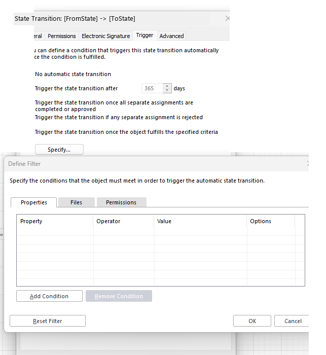<br>
<sub><strong>State Transition — Trigger tab</strong>, "criteria" option selected, with its Define Filter sub-dialog open. This is the actual UI behind the <code>TriggerMode</code>/<code>TriggerCriteria</code>/<code>TriggerInDays</code> split above — note the "after ___ days" field defaulted to <strong>365</strong> here too, consistent with the confirmed default noted in §1.2.</sub>
</p>

**The line style is a rendering signal, not the source of truth — always read `TriggerMode` directly.** The originally-plausible hypothesis ("dashed = automatic-with-a-condition, solid = manual-with-a-condition") is confirmed **wrong as stated**: mode-0 edges can carry zero condition and still render solid (because *manual* is what solid means, not *unconditional*), and mode-4/5 edges render dashed whether or not they carry a real criteria string (because *engine-evaluated* is what dashed means, not *has a condition*). The split is purely `TriggerMode` — human-selectable vs. engine-evaluable — not condition presence.

**Confirmed rendering anomaly — do not fold into the rule above:** of the 36 sampled transitions, exactly **one** (`TriggerMode: 4`, a real non-null criteria string, otherwise indistinguishable in the source data from its correctly-dashed neighbors) rendered **solid**, verified twice at pixel level to rule out a resolution/export artifact. No field in the underlying data explains it. Treat this as a known, isolated, unresolved diagram-export inconsistency — **not** as evidence that the `TriggerMode` rule above needs revision, and not as a pattern to generalize from a sample of one.

**Engine evaluation timing, confirmed live:** automatic transitions are evaluated on check-in, and a state with *multiple* mode-4/5 outgoing edges still auto-resolves correctly in a single check-in cascade (confirmed: one state with two automatic outgoing edges — one criteria-gated, one an unconditional fallback — auto-resolved cleanly without stalling). This rules out "a state only auto-fires when it has exactly one unconditional outgoing edge" as the real mechanism; the engine genuinely evaluates each automatic edge's own criteria independently.

**`TriggerCriteria` is an opaque, engine-internal export format, not a human-authorable string 🟢.** Confirmed: the criteria field is populated by M-Files' own `SearchConditions.GetAsExportedSearchString()` call — a serialized, internal search-condition representation, not readable or writable as plain text. Any tool that needs to *set* a real criteria condition must go through M-Files' search-condition object model, not string-template the exported format.

### 1.2 `TriggerInDays` — periodic evaluation, not just check-in 🟢

`TriggerInDays` is a real, stored, numeric field on every transition — automatic and manual alike. In a live 64-transition workflow, **63 of 64 transitions carried the same value (365)**, present uniformly across manual and automatic transitions alike (including manual edges where a day-count has no operational meaning) — this is the M-Files UI's stored default, not an active per-edge gate, in the overwhelming majority of cases.

**Confirmed real (non-default) use, exactly one instance:** a transition with `TriggerMode: 4`, no criteria, and `TriggerInDays: 1` — meaning an object sitting in the source state does **not** auto-advance on the very next check-in the way other unconditional automatic edges do; it waits up to a 1-day evaluation cycle first. This is the confirmed, concrete evidence that M-Files' automatic-transition engine runs **periodically, independent of check-in activity** — not purely reactively — matching M-Files' own documented behavior that automatic triggers run "both when an object is altered... and also periodically for situations where the trigger depends on an external system" (see [State transition trigger](https://userguide.m-files.com/user-guide/latest/eng/workflow_state_transition_trigger.html)).

**Practical implication:** a translator or diagram reader must not assume every automatic transition fires "immediately." A non-default `TriggerInDays` value changes the effective latency of a transition without changing anything else about it — this is a real, distinct dimension of automatic-transition behavior, not a cosmetic field.

### 1.3 `NextStateID` and `AllowStateTransition` — the VBScript `Out`-mode escape hatches 🟢

Inside an automatic transition's trigger script context (`TriggerAllowedByVBScript`), M-Files exposes two `Out`-mode script variables that can change the transition's outcome at runtime, independent of what the diagram or the criteria already decided:

- **`NextStateID`** (`Out`-mode Number) — if set, redirects the object to a state *other than* the diagram-drawn destination. This means a workflow diagram's drawn arrow is only a **guaranteed** destination if no VBScript on that edge reassigns `NextStateID`.
- **`AllowStateTransition`** (`Out`-mode Boolean) — allows or denies the transition outright, separate from whatever `TriggerCriteria` already matched. A script can gate a transition on logic no static criteria expression could represent (e.g. an elapsed-time check — see §1.5).

**Confirmed live, swept exhaustively:** every VBScript-bearing transition in a real 64-transition/47-state workflow (10 of them) was read in full. **Zero used `NextStateID`.** In this workflow, every diagram-drawn arrow was a reliable, guaranteed destination — none of the real VBScript logic present silently redirected an object elsewhere. **Exactly one transition explicitly set `AllowStateTransition = False`** under a real gating condition; the rest only ever conditionally set it to `True`.

**Practical implication — this must be swept for, not assumed:** the *possibility* of `NextStateID` overriding a drawn arrow is real and documented at the API level. A workflow with zero VBScript-driven overrides is a property of that specific workflow's authored scripts, not a guarantee of the platform. Any tool treating a diagram's arrows as ground truth must actually parse each automatic transition's script content for `NextStateID` assignment before trusting the diagram — confirmed absence in one real workflow is not proof of absence in general.

**Formalized as a tooling requirement, not left as prose alone:** the Translator/Validator built against this document (§3.5) implements this exact requirement — every resolved `script(Name)` edge has its sidecar-supplied VBScript body statically scanned for the literal token `NextStateID`; a match produces a validation Warning naming the edge and stating plainly that its diagram-drawn destination is not guaranteed. This is a direct, mechanical application of this section's finding, not a new claim — a static text scan cannot simulate what a script actually does at runtime (obfuscation, string-building the identifier, etc. would all evade it), so a clean scan result is evidence, not a platform guarantee, exactly as the paragraph above already states.

### 1.4 The state/transition architectural split 🟢

M-Files' object model separates *where behavior lives* between the two workflow object types — but the separation is not as clean as a first pass at the tab list suggests. This section has now been corrected **twice**, both times the same way (a screenshot already embedded in this section contradicted the bullet list sitting right above it, and the bullet list was wrong, not the screenshot) — both corrections are kept visible below rather than silently folded into a rewritten "clean" version, per this document's own discipline.

- **States** own the **Conditions** tab (Preconditions — properties an object must already have before entering this state; Postconditions — properties an object must acquire before it can leave this state) and the **Actions** tab (what happens when an object enters this state — see §2.2 for the full option set). These two are genuinely state-exclusive, confirmed against both live API data and the screenshots below.
- **Transitions** (the arrows) own **Permissions**, **Electronic Signature**, and **Trigger** — genuinely transition-exclusive, confirmed the same way.
- **General and Advanced are NOT exclusive to either side — both dialogs have their own version of both tabs.** Two separate corrections, same root cause, same fix pattern each time:
  - **Advanced (corrected first):** both dialogs carry an Advanced tab holding exactly two fields, **Aliases** and **Unique ID**, and nothing else — a minimal identifier tab, not a substantive configuration surface. See the Advanced-tab screenshots further down this section.
  - **General (corrected second, identical pattern):** both dialogs also carry a General tab. On **State Properties** it holds Name, Description for admin, Description for users, and a Technical state checkbox — see the screenshot immediately below, which was already embedded in this section before this correction, sitting directly under a bullet list that incorrectly excluded General from the state side entirely. On **State Transition** it holds Name and Description — see §2.5; unlike the state side, no screenshot of the transition's own General tab exists anywhere in this project's evidence, so that half is sourced from M-Files' vendor documentation only, not confirmed here.

<p align="center">
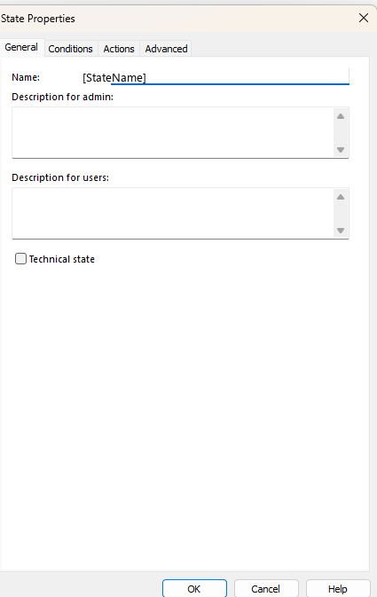<br>
<sub><strong>State Properties — General tab</strong> (Name, descriptions, Technical state)</sub>
</p>

<p align="center">
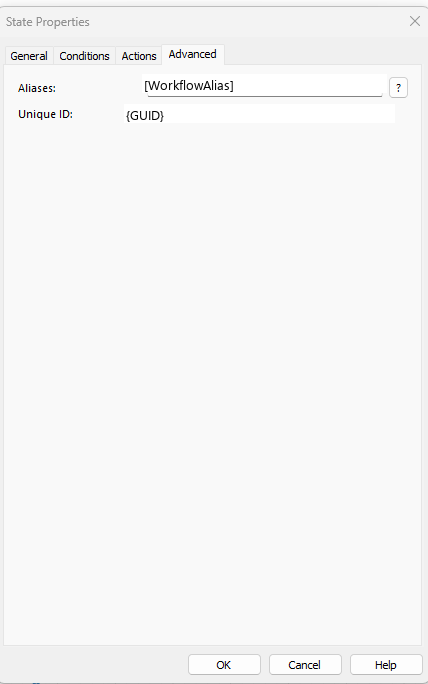<br>
<sub><strong>State Properties — Advanced tab</strong></sub>
&nbsp;&nbsp;&nbsp;
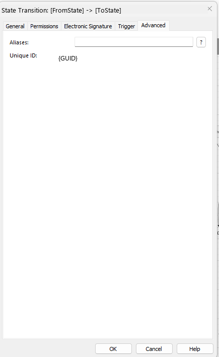<br>
<sub><strong>State Transition — Advanced tab</strong></sub>
<br><sub>Same two fields on both — Aliases and Unique ID — confirming both (1) the tab exists on both dialogs and (2) it's minimal on both.</sub>
</p>

**Confirmed direct consequence:** a state can come back completely "empty" from a structural API scan — zero configured entry actions, zero pre/postconditions — and still be the real origin of significant, entirely automated routing behavior, because that behavior lives on its **outgoing transitions'** Trigger tabs, not on the state itself. Confirmed directly in this project: a live production state with ten outgoing edges and zero of its own configured actions/conditions was the real decision point for an entire branch of workflow behavior, entirely via those ten transitions' individual `TriggerMode`/`TriggerCriteria` values. **A "logic-free" state, by itself, tells you nothing about whether real automated behavior originates there — you have to read its outgoing transitions, not just the state.**

**Reinforcement, not a new fix:** two further live screenshots (§2.2 — a duplicate-check state and a routing-hub state, both captured while documenting the Set Properties mechanism) additionally show the same General/Conditions/Actions/Advanced tab strip on two more real states. Weight-of-evidence only — the correction above already stands on its own screenshot evidence (§1.4's embedded screenshots) and needs no further fix; these two are simply two more data points confirming the same already-corrected claim.

### 1.5 The VBScript elapsed-time retry pattern (generalized) 🟢

Confirmed as a real, repeated pattern (present on multiple separate transitions within a single live workflow) for building an automatic "wait, then retry" edge with no external scheduler: an automatic transition's trigger script reads a timestamp value off the object, computes elapsed time against the current time, and sets `AllowStateTransition = True` only once a threshold has passed — otherwise the transition is skipped on this evaluation pass and re-tried on the next periodic engine pass (see §1.2 — this pattern **depends on** periodic evaluation, not just check-in evaluation, to ever succeed for an object that isn't actively being edited).

Generalized VBScript shape (not tied to any specific property or state from this project):

```vbscript
Dim elapsedMinutes
elapsedMinutes = DateDiff("n", CDate(<timestamp property value>), Now())

If elapsedMinutes > <threshold in minutes> Then
    AllowStateTransition = True
End If
' AllowStateTransition left False/unset otherwise — the engine
' will re-evaluate this transition on its next periodic pass.
```

This is the documented-in-practice way to express a **timer/delay** semantic natively, without any external orchestration — see the BPMN mapping in §3 ("Timer event").

<p align="center">
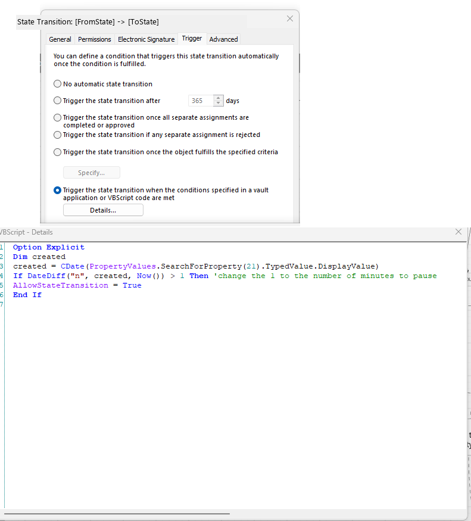<br>
<sub><strong>State Transition — Trigger tab, VBScript-gated option</strong>, with its VBScript Details editor open on a real (unmodified, unredacted — the script itself contains no project-specific identifiers) instance of this exact pattern. <code>PropertyValues.SearchForProperty(21)</code> is the built-in <strong>Created</strong> property — this screenshot is the direct confirmation for the "plausibly <code>Created</code>, not independently confirmed which one" caveat in this project's own property-21 sweep notes.</sub>
</p>

**Example — the retry pattern as a diagram** (generic state names, not from this project; see §3.5 for the `script(...)` label convention this uses):

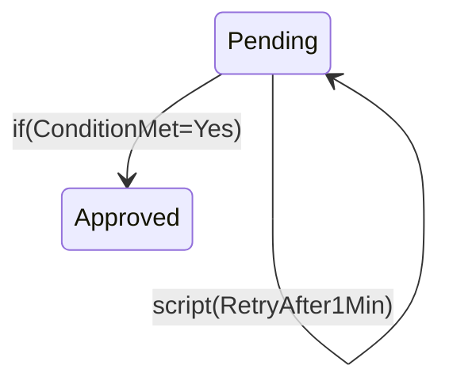
```mermaid
stateDiagram-v2
    Pending --> Pending : script(RetryAfter1Min)
    Pending --> Approved : if(ConditionMet=Yes)
```

The self-loop is the retry: on each periodic evaluation pass, the script checks elapsed time and either leaves the object in `Pending` (not enough time has passed) or the criteria-based edge fires once the condition is actually met.

### 1.6 `Evaluation priority` — explicit per-transition ordering for parallel automatic transitions 🟢

A real, stored Trigger-tab field, confirmed directly from a live screenshot, previously undocumented anywhere in this project: **Evaluation priority**, a numeric field (confirmed default `100`) on every transition's Trigger tab, directly below the trigger-condition radio group. Vendor label text, quoted verbatim from the live UI: *"You can define the priority in which parallel transitions are evaluated on the server. The lower the number, the higher the priority."*

<p align="center">
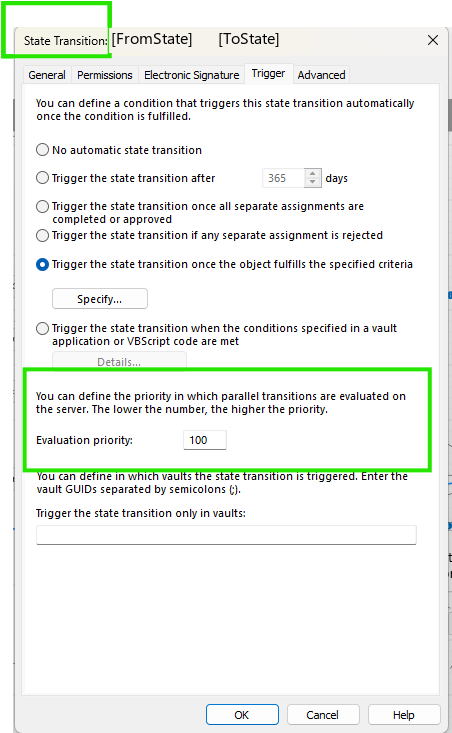<br>
<sub><strong>State Transition — Trigger tab</strong>, showing the full trigger-condition radio group already documented above plus the <strong>Evaluation priority</strong> field (green box), confirmed defaulted to <code>100</code> on a real, live transition.</sub>
</p>

**Corrects an external assumption, not just adds a fact.** A draft PRD outside this document guessed that transition evaluation order was determined by array/collection order in code (i.e. whichever automatic transition happened to be enumerated first would be evaluated first). That assumption is now confirmed wrong: M-Files exposes an **explicit, per-transition numeric priority field** for exactly this purpose, independent of any collection or enumeration order. A translator or emitter that infers evaluation order from array position rather than reading this field will get it wrong whenever a workflow author has set a non-default value.

**Practical implication:** this is a real, distinct field a translator must account for wherever multiple automatic (`TriggerMode` 4/5) outgoing edges exist on the same state — see §3.5 for how it's represented in the labeling convention and sidecar schema.

---

## 2. Documented, Not Independently Verified in This Project

Everything in this section is sourced from M-Files' own published user-guide documentation. It has **not** been exercised or confirmed against live behavior in the course of this project — treat it as vendor-documented fact, not project-verified fact, until it is.

### 2.1 Electronic Signature tab (transition-level) 🔵

- Enabled per-transition via **"Require electronic signature for this action."** When enabled, the user must authenticate and sign before the state transition completes.
- **Restricted to Windows-authenticated users only** — federated or other non-Windows authentication methods cannot execute a signature-gated transition.
- **Signature meaning:** either a predefined reason/meaning pair, or a custom description (up to 500 characters) with support for dynamic placeholders (`%SIGNED_BY%`, `%SIGNED_FROM_STATE%`, `%SIGNED_TO_STATE%`).
- Signatures can be associated with an object metadata property, or saved as a separate signature object with an automatic relationship back to the primary object.
- **Hard limitation:** a signature-gated state change can only be performed **one object at a time** — no batch/multi-select signing.
- Requires M-Files' separate, separately-licensed **Electronic Signatures and Advanced Logging** module.

Source: [Electronic signatures](https://userguide.m-files.com/user-guide/latest/eng/Electronic_signature.html).

<p align="center">
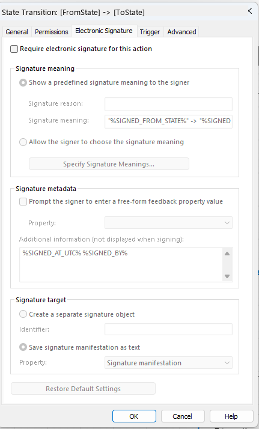<br>
<sub><strong>State Transition — Electronic Signature tab.</strong> The <code>%SIGNED_FROM_STATE%</code>/<code>%SIGNED_AT_UTC%</code>/<code>%SIGNED_BY%</code> placeholders visible here are M-Files' own generic tokens (documented above), not project-specific.</sub>
</p>

### 2.2 Full Actions-tab option set (state-level) 🔵

Per M-Files' documentation, a workflow state's Actions tab supports the following options, multiple of which can be selected simultaneously for the same state:

| Action | Effect |
|---|---|
| Set permissions | Changes the effective permissions on the object version as of this state |
| Mark for archiving | Flags the object for archival |
| Delete | Removes the object — a distinct action from archiving, not a synonym for it |
| Assign to user | Routes the object to a specific user |
| Create separate assignments | Fans the task out to multiple assignees at once |
| Send notification | Sends an alert about the state change |
| Set properties | Writes fixed or computed property values on entry |
| Convert to PDF format | Converts the document to PDF on entry |
| Run script | Executes a VBScript on entry |

Source: [Workflow state actions](https://userguide.m-files.com/user-guide/latest/eng/State_actions.html), [Set permissions, delete, and mark for archiving](https://userguide.m-files.com/user-guide/latest/eng/set_permissions_delete_and_mark_for_archiving.html).

<p align="center">
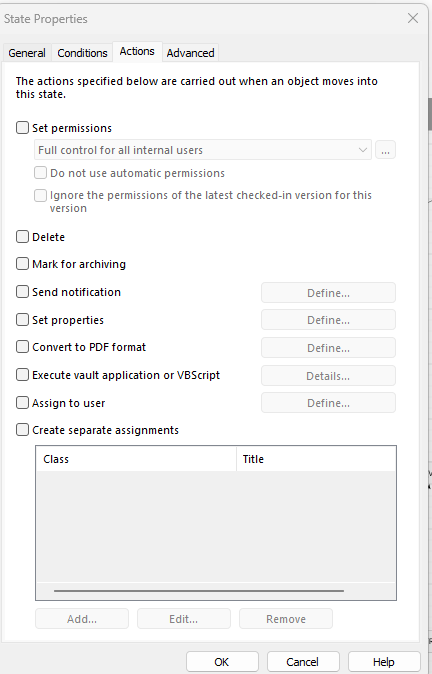<br>
<sub><strong>State Properties — Actions tab</strong> — the full checkbox list matches the table above exactly.</sub>
</p>

Each checked option opens its own configuration dialog. Six of those sub-dialogs, grouped here rather than scattered through the text:

<table>
<tr>
<td align="center" width="33%">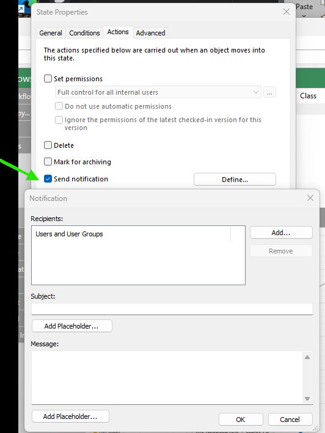<br><sub>Send notification</sub></td>
<td align="center" width="33%">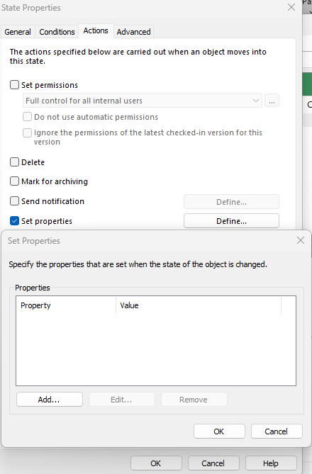<br><sub>Set properties</sub></td>
<td align="center" width="33%">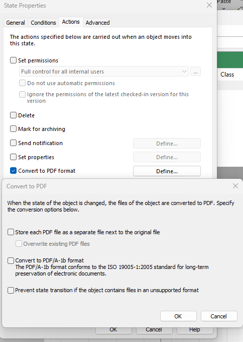<br><sub>Convert to PDF format</sub></td>
</tr>
<tr>
<td align="center" width="33%">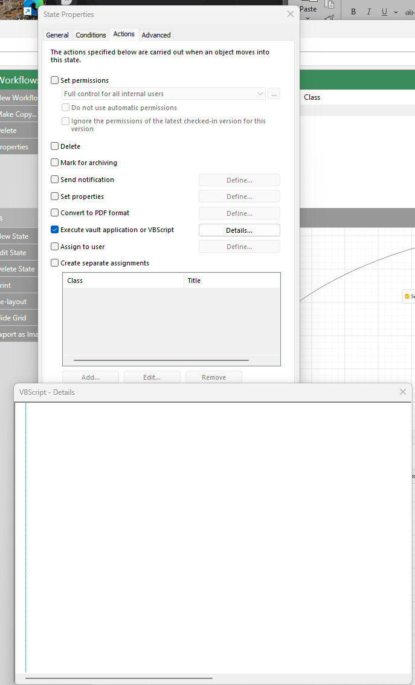<br><sub>Execute vault application or VBScript ("Run script")</sub></td>
<td align="center" width="33%">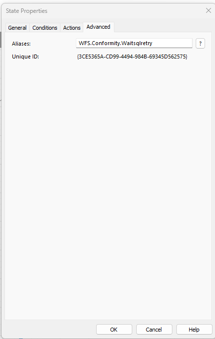<br><sub>Assign to user</sub></td>
<td align="center" width="33%">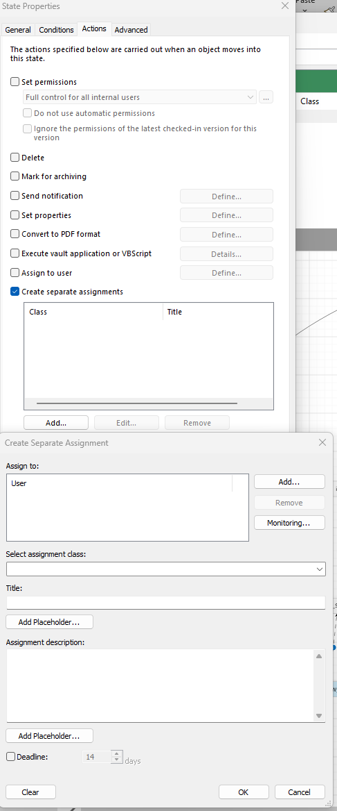<br><sub>Create separate assignments</sub></td>
</tr>
</table>

**Set properties — the Property/Value pair model, now confirmed by three independent live screenshots rather than one.** The Set Properties dialog holds a table of Property/Value pairs, built with Add/Edit/Remove controls; each value can be a fixed literal or a computed value (the same fixed-vs-computed split already noted for Preconditions/Postconditions in §2.4). This structure is identical across all three screenshots captured of this dialog in this project — the single-property thumbnail already grouped above, plus two further, independent state examples below:

<p align="center">
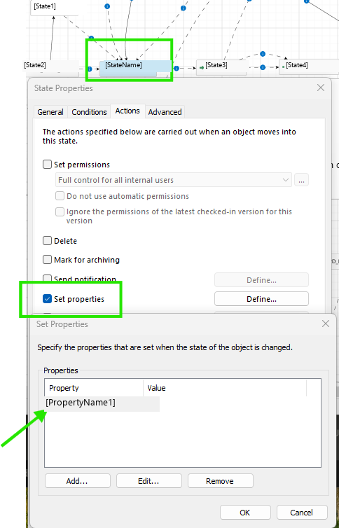
&nbsp;&nbsp;
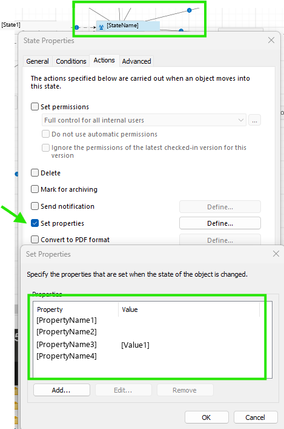
<br>
<sub><strong>Two further, independent Set Properties examples, each on a different state</strong> — anonymized to the same standard as every other screenshot in this document (<code>[StateName]</code>/<code>[PropertyNameN]</code>/<code>[Value1]</code> placeholders in place of real identifiers). <strong>Left:</strong> a duplicate-check state, one property set. <strong>Right:</strong> a routing-hub state — visible in the anonymized diagram fragment above the dialog, this state has multiple outgoing manual transitions — yet it still carries its own Set Properties action with four properties set. The property-setting shown here is a mechanism distinct from the routing decision itself: routing lives entirely in which manual transition a human selects (§1.1 — <code>TriggerMode 0</code>), not in this dialog. A state can be a routing hub and independently have its own entry-action property-setting; neither implies nor requires the other.</sub>
</p>

### 2.3 Permissions tab (transition-level) 🔵

Controls **which users/groups are allowed to perform this specific transition** — the mechanism behind a "restricted human approval" step. Three selection methods:

1. **Direct** — specific named users or groups.
2. **Metadata-based (pseudo-users)** — permission derived dynamically from the object's own metadata (e.g. only the project manager named on the object can approve it).
3. **Prior-transition-based** — restrict to whoever performed a specific earlier transition on the same object (e.g. only the user who approved it can later undo that approval).

Source: [Workflow State Transition Permissions](https://userguide.m-files.com/user-guide/latest/eng/State_transition_permissions.html).

<p align="center">
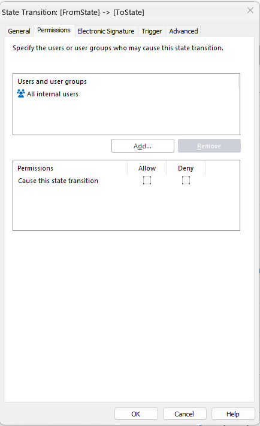<br>
<sub><strong>State Transition — Permissions tab.</strong> The screenshot shows the default, unrestricted state ("All internal users"); §3's BPMN mapping for "Human task / approval" is what this tab looks like once a specific group replaces that default.</sub>
</p>

### 2.4 Conditions tab, full vendor description (state-level) 🔵

- **Preconditions** — properties an object must already have *before* it can be moved into this state.
- **Postconditions** — properties an object must acquire before it can be moved *out of* this state.
- The documentation does not explicitly spell out UI-level enforcement behavior when conditions aren't met; the transition is blocked until conditions are satisfied. VBScript and the M-Files API can be used to build custom condition logic beyond simple property presence checks.

Source: [Workflow state conditions](https://userguide.m-files.com/user-guide/latest/eng/State_conditions.html), [Adding States to a Workflow](https://userguide.m-files.com/user-guide/latest/eng/adding_states_to_a_workflow.html).

<p align="center">
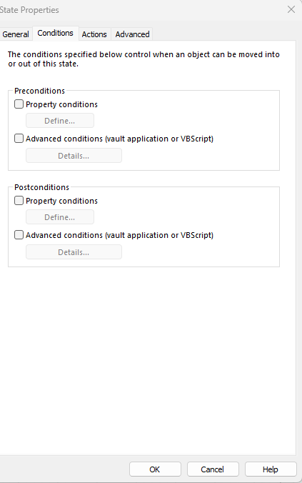<br>
<sub><strong>State Properties — Conditions tab</strong> — Preconditions and Postconditions, each with a Property-conditions filter and an Advanced (vault application or VBScript) option.</sub>
</p>

Both the Property-conditions filter and the Advanced/VBScript option open their own sub-dialog. Grouped by which side of the tab they belong to:

<table>
<tr>
<td align="center" width="50%">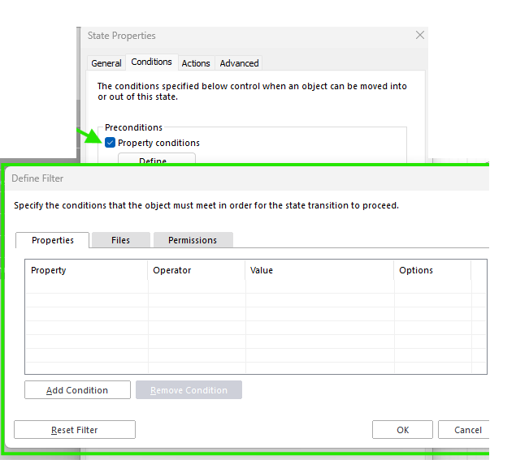<br><sub>Preconditions → Define Filter</sub></td>
<td align="center" width="50%">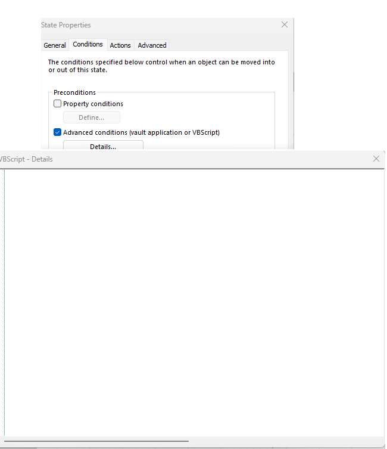<br><sub>Preconditions → Advanced (VBScript) Details</sub></td>
</tr>
<tr>
<td align="center" width="50%">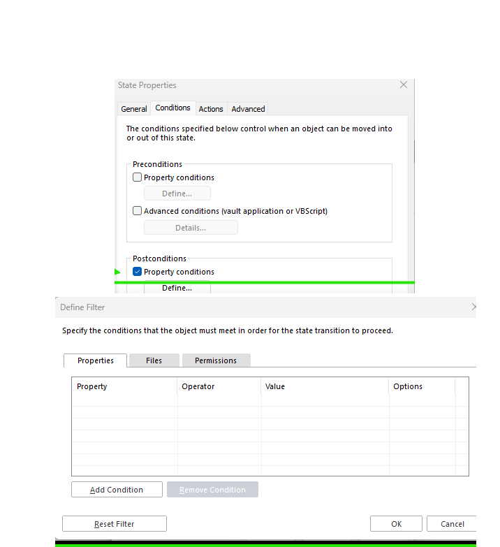<br><sub>Postconditions → Define Filter</sub></td>
<td align="center" width="50%">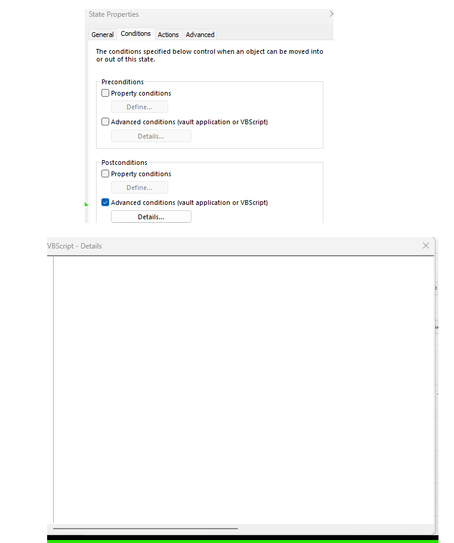<br><sub>Postconditions → Advanced (VBScript) Details</sub></td>
</tr>
</table>

### 2.5 General tab, state-level and transition-level 🔵

§1.4 confirms (via screenshot) that **both** the State Properties and State Transition dialogs have their own General tab. This subsection covers what the vendor documentation says those fields actually *do* — the existence and labels of the state-side fields are already 🟢-confirmed in §1.4; their semantics, and the transition-side fields' existence itself (no screenshot exists for that dialog), are 🔵 only.

**State Properties — General tab:**

- **Name** — the state's display name.
- **Description for admin** / **Description for users** — free-text descriptions; the documentation reviewed does not further distinguish their exact display contexts beyond the admin/user split implied by the field labels.
- **Technical state:** *"Use this option for states that the workflow moves through automatically and that users do not use. When the option is enabled, the state is not shown in the visualized workflow on the metadata card. This makes the workflow easier to use and understand."* — quoted directly from the source below, not paraphrased.

**State Transition — General tab** *(no screenshot exists for this dialog anywhere in this project's evidence — see the flagged gap this closes)*:

- **Name** — enter a name for the state transition.
- **Description** — an optional description of the transition.

Source: [Adding States to a Workflow](https://userguide.m-files.com/user-guide/latest/eng/adding_states_to_a_workflow.html) (Technical state), [Adding State Transitions to a Workflow](https://userguide.m-files.com/user-guide/latest/eng/adding_state_transitions_to_a_workflow.html) (transition Name/Description).

### 2.6 Initial state designation (workflow-level) 🔵

Which state a newly created object enters a workflow in is **not a flag set on the state itself** — no state has an "is initial" checkbox anywhere in either dialog covered by this document. Instead it's determined by **list order**: *"If a class has a default workflow and a new object is created in the class, the first state is chosen automatically only if the first state is the first on the States list of the Workflow Properties dialog,"* and *"the order of states on the list overrides the order of states in the graphical workflow designer."* Reordering is done with arrow buttons on the Workflow Properties dialog's state list in M-Files Admin — a workflow-level setting, not a per-state one.

Source: [Creating a new workflow](https://userguide.m-files.com/user-guide/latest/eng/creating_a_new_workflow.html).

**On terminal states — deliberately not a separate entry here:** §3's BPMN mapping ("End event" row) already covers the two native terminal shapes (a state with no outgoing transitions, or a state whose Actions tab includes Delete). Checked specifically while researching this section: none of the vendor documentation pages reviewed here describe any additional dedicated "final state" flag or mechanism beyond that structural fact — so there is nothing further to promote into its own entry. If a dedicated terminal-state mechanism exists in M-Files beyond "no outgoing transitions," it wasn't found in this pass.

---

## 3. BPMN → M-Files Mapping

| BPMN concept | M-Files equivalent | Notes |
|---|---|---|
| Task / Activity | State | |
| Sequence flow | Transition | |
| Exclusive / parallel gateway | Multiple outgoing transitions from one state | Each outgoing transition carries its own trigger mode and condition — the "gateway logic" is distributed across the edges, not held in the state |
| Timer event | Transition Trigger: `TriggerInDays` (§1.2) **or** the VBScript elapsed-time pattern (§1.5) | `TriggerInDays` is the declarative form; the VBScript pattern is needed when the delay must be measured from a dynamic timestamp rather than a fixed schedule |
| Message / signal event | Transition Trigger: criteria-based (`TriggerMode 4` + real `TriggerCriteria`) or VBScript-gated (`TriggerMode 5`) | |
| Human task / approval | Transition with restricted Permissions (§2.3), optionally + Electronic Signature (§2.1) | |
| End event | State with no outgoing transitions, **or** a state whose Actions tab includes Delete | Both are confirmed-plausible native shapes; which one is correct depends on whether the object should persist |
| Swim lane | **No direct equivalent** | Must be approximated via transition Permissions or property-based conditions — a **lossy** translation, not 1:1. Flag any BPMN diagram with meaningful lane structure as a translation that will lose information. |

### Worked example

A single generic diagram touching most of the rows above at once (generic state names, not from this project):

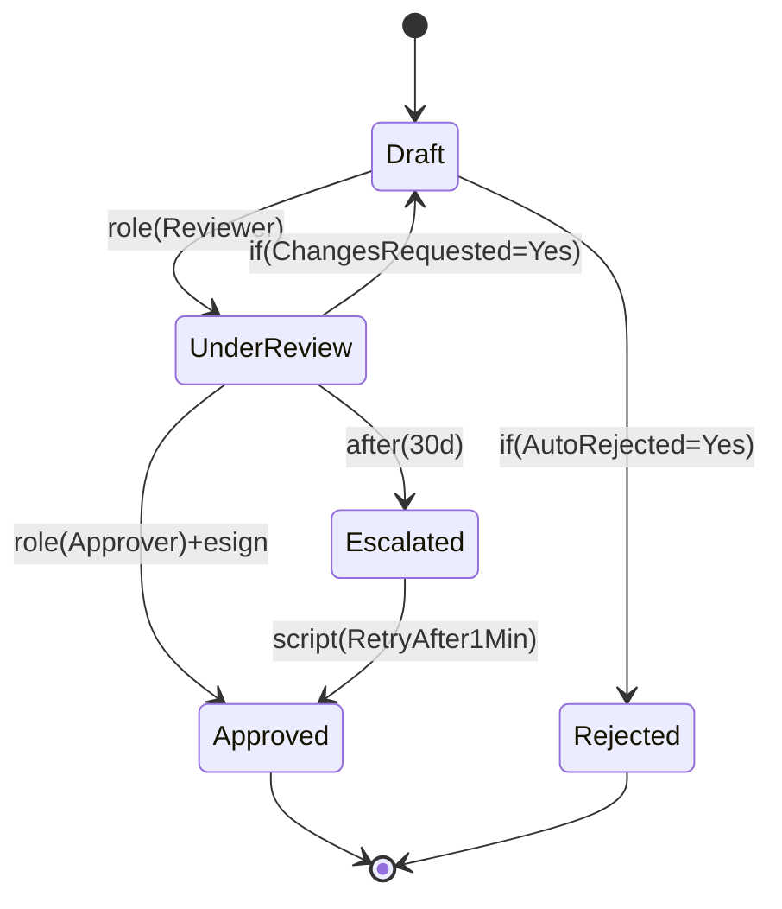
```mermaid
stateDiagram-v2
    [*] --> Draft
    Draft --> UnderReview : role(Reviewer)
    Draft --> Rejected : if(AutoRejected=Yes)
    UnderReview --> Approved : role(Approver)+esign
    UnderReview --> Draft : if(ChangesRequested=Yes)
    UnderReview --> Escalated : after(30d)
    Escalated --> Approved : script(RetryAfter1Min)
    Approved --> [*]
    Rejected --> [*]
```

Reading it against the table: `Draft`'s two outgoing edges are the **exclusive gateway** row (each edge carries its own trigger/condition, not the state); `UnderReview --> Escalated` is the **timer event** row; `Draft --> Rejected` and `UnderReview --> Draft` are **message/signal event** rows (criteria-based); `UnderReview --> Approved` is the **human task/approval** row, with Electronic Signature required; `Escalated --> Approved` is the **retry-loop** shape from §1.5; both `[*]` targets are **end events**. No swim lanes are shown — per the row above, there's nothing in this vocabulary to show.

---

## 3.5 Mermaid Labeling Convention (Round-Trip Fidelity Spec)

For BPMN ⇄ M-Files translation work to be more than a diagram, the Mermaid representation needs an exact, unambiguous encoding for each mechanism above — not just a human-readable approximation. This section is the spec.

| M-Files mechanism | Mermaid syntax | Encodes |
|---|---|---|
| Manual transition | `StateA --> StateB` (no label) | `TriggerMode = 0` |
| Time-based automatic | `StateA --> StateB : after(30d)` | `TriggerMode = 4` or `5`, `TriggerInDays = 30` |
| Criteria-based automatic | `StateA --> StateB : if(Property=Value)` | `TriggerMode = 4` or `5`, `TriggerCriteria = {...}` (§1.1 — criteria is an opaque engine-exported format; the compact `if(...)` syntax is a human/tool-facing proxy for it, not a literal serialization) |
| Automatic, mechanism confirmed but criteria undecoded (§3.5 Decision 6) | `StateA --> StateB : auto(4)` or `auto(5)` | `TriggerMode = 4` or `5` — the confirmed value, read directly from the argument, not guessed. `TriggerCriteria = null`. `CriteriaUnconfirmed = true`. A deliberate author assertion ("I know this is automatic, I don't know the specific rule"), not an unparseable label — see Decision 6 below for why this is not the same thing as the freeform-skeleton fallback. |
| VBScript-gated | `StateA --> StateB : script(RetryAfter1Min)` | `TriggerAllowedByVBScript` populated. Mermaid labels cannot cleanly hold real VBScript inline — `script(<name>)` is a **reference**, not the code. The actual VBScript body lives in an accompanying reference block (see Appendix A), keyed by the same name used in the label. |
| Restricted-permission (human) transition | `StateA --> StateB : role(Approver)` | A transition-level Permissions entry (§2.3) restricting who may perform it. If Electronic Signature is also required, append: `StateA --> StateB : role(Approver)+esign` |
| Evaluation priority (§1.6) | Append `+priority(N)` to an automatic label, e.g. `StateA --> StateB : if(Property=Value)+priority(50)` | `EvaluationPriority = N`. Governs the order in which **parallel automatic transitions on the same state** are evaluated by the server — lower number, higher priority (§1.6). Only meaningful on `after(...)`/`if(...)`/`script(...)` edges; omit it on manual (unlabeled or `role(...)`) edges, where the field is not evaluated for ordering purposes. |

**No sidecar entry needed for evaluation priority — deliberately, and this is worth stating plainly given the correction directly below.** Unlike a VBScript body, `EvaluationPriority` is a single small integer with no multi-line content Mermaid's label syntax can't hold — it fits the same inline, self-contained pattern as `after(Nd)` and `if(Property=Value)`, so it is encoded the same way, as a plain appended suffix. Nothing about this field needed the sidecar file at all.

**Reference diagram — one edge per convention, in table order:**

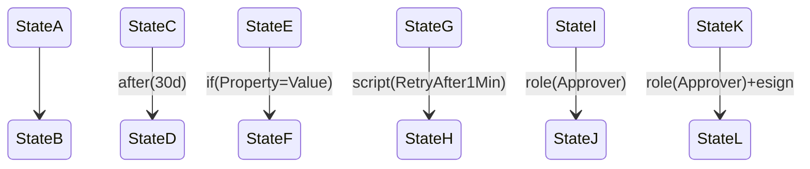
```mermaid
stateDiagram-v2
    StateA --> StateB
    StateC --> StateD : after(30d)
    StateE --> StateF : if(Property=Value)
    StateG --> StateH : script(RetryAfter1Min)
    StateI --> StateJ : role(Approver)
    StateK --> StateL : role(Approver)+esign
```

**Directional guarantee — state this plainly, do not let it be assumed symmetric:**

- **M-Files → Mermaid (export) is lossless and straightforward** for every mechanism this convention covers: `TriggerMode`, `TriggerInDays`, `TriggerCriteria` presence, `TriggerAllowedByVBScript` presence, and transition Permissions/Electronic Signature can all be read directly from the API and rendered into the labeled syntax above, with the VBScript body captured in the appendix block.
- **Mermaid → M-Files (import) is only fully automatable for diagrams that use this convention's labels.** A diagram built with these exact label forms round-trips completely: every arrow becomes a transition with the correct `TriggerMode`/`TriggerInDays`/criteria/script-reference/permissions set programmatically.
- **A labeled edge whose text doesn't parse against any grammar in the table above can only produce a structural skeleton on import** — `TriggerMode = 0` (manual) as the default, no `TriggerCriteria`, no Permissions restriction, no electronic signature — all of that requires manual configuration in M-Files afterward, and the original label text is preserved for human review rather than guessed at (§6.2's `if reviewer rejects` edge is the concrete demonstration). **This is a distinct case from a genuinely unlabeled edge (`StateA --> StateB`, no label at all) — that is this table's own first row, a deliberate and lossless encoding of a manual transition, not a fallback.** Collapsing these two into one "unlabeled" case was an earlier imprecision in this section, corrected here after the Translator/Validator's own test suite proved the distinction has real consequences: §6.2's acceptance test (the freeform-prose edge) fails without it, because the tool would otherwise have to either wrongly flag every plain manual edge as degraded or wrongly treat unparseable prose as a clean, deliberate result. See Decision 2 below for the full reasoning, and §6.6's worked example for the visual case.

### Design decisions codified here — reasoning, not just rules

Eight specific decisions behind the convention above, recorded with *why*, not just *what*, so a future maintainer doesn't have to re-derive them or accidentally re-open them. Worked visual examples for Decisions 1 and 3 are in §6.6–§6.8; Decision 5's worked example is §6.10; Decision 6's worked example is §6.13. Decisions 7 and 8 have no worked visual example — 7 is a scope boundary, not a translation rule, and 8 governs the not-yet-built emitter.

**Decision 1 — no line-style inversion between Mermaid and M-Files (confirmed; do not implement any flip).** §1.1 already confirms the real M-Files rendering: `TriggerMode 0` (manual) renders **solid**, `TriggerMode 4`/`5` (automatic) renders **dashed**. This project's mapping from that fact onto the Mermaid side is **direct, not inverted**, in both translation directions: an automatic-coded Mermaid edge (`if(...)`, `after(...)`, or `script(...)`) always corresponds to M-Files' dashed rendering, and a manual-coded edge (unlabeled, or `role(...)`) always corresponds to M-Files' solid rendering — on export *and* on import. No flip is applied either way.

This is a deliberate choice, not an oversight, for two reasons. First, this project's Mermaid usage is **not** attempting full BPMN 2.0 compliance — §4 already establishes Mermaid `stateDiagram-v2`, not BPMN XML, as the intermediate representation — so there is no BPMN "line-style tradition" being preserved either way. Real BPMN 2.0 encodes manual-vs-automatic through **task-type icons** on the activity shape, not through sequence-flow line style, so appealing to "BPMN convention" here would cite a convention BPMN itself doesn't use. Second, a direct, non-inverted mapping avoids a translation rule that would need to be implemented — and kept correct — twice (once in the exporter, once in the importer), in exchange for a fidelity benefit that isn't real: neither BPMN nor this document's own convention ties meaning to line style at the Mermaid layer in the first place.

**Surfaced while drafting this section, not previously documented, and it changes what "no inversion" can mean in practice: Mermaid's `stateDiagram-v2` cannot render a dashed transition line at all.** Confirmed directly — `stateDiagram-v2`'s grammar defines exactly one transition arrow token (`-->`); feeding it flowchart-style dotted syntax (`-.->`) against a real Mermaid renderer fails with a hard parse error, not a graceful fallback to a dashed style. This means the "solid vs. dashed" half of this decision describes the **M-Files side only** (§1.1) and the human/tool-level correspondence to Mermaid's *labels* — it is not, and cannot be, an instruction to draw an actual dashed line anywhere in a Mermaid diagram. The label convention (the table above) is therefore not a stylistic alternative to a line-style convention — in this intermediate representation, it is the **only** mechanism available for encoding the distinction at all. See §6.6, which shows this constraint directly (both a manual and an automatic edge render as identical solid Mermaid lines) rather than asserting it.

**Decision 2 — two distinct "no real rule matched" cases, not one, each with its own default and its own honesty about what happened.** Earlier drafts of this section used "unlabeled" loosely enough to cover two situations that need to be told apart:

- **(a) A genuinely bare edge — `StateA --> StateB`, nothing after it.** This is the labeling convention's own first table row: a deliberate, lossless encoding of a manual transition. `TriggerMode = 0`, no criteria, no permissions — and this is the **correct, intended** result, not a compromise. Nothing was lost; nothing needs review. The Translator/Validator marks this case `IsSkeleton = false` for exactly this reason.
- **(b) A labeled edge whose text doesn't parse against `role(...)`/`after(...)`/`if(...)`/`script(...)`** — prose, a typo'd grammar, anything outside the table above. This one really is a fallback: the importer cannot know what was intended, so it produces the same field values as case (a) (`TriggerMode = 0`, no criteria, no permissions) but flags them as a **skeleton** and preserves the original text for a human to resolve. §6.2's `PendingReview --> Rejected : if reviewer rejects` edge is the concrete example — see §6.4's discussion of the two genuinely different real configurations that prose could have meant.

Both cases resolve to the *same field values* (§3.5 always defaults toward the smaller blast radius — see the safety reasoning below), which is exactly why conflating them was an easy mistake to make and why it matters that the *labeling* differs: a plan or report that can't tell "this was deliberate" from "this needs your attention" is silently hiding the second case inside the first. **This was not a hypothetical concern — it was found by building the Translator/Validator against this section and discovering that §6.2's own acceptance test fails without the distinction:** a resolver that treats "no label" and "unparseable label" identically has no way to set `IsSkeleton` correctly for either one without breaking the other. The document was underspecified here, not the code — this section is the fix, not just a note about the fix.

The reasoning behind *why* the shared default leans manual, restated explicitly rather than left implicit: **a workflow that silently sits idle until a human acts is a safer failure mode than one that silently advances on its own.** An importer that guessed "automatic" for an unresolved edge could route a real object through an unintended state change with no human in the loop and no record of why it happened. Defaulting to "manual" instead merely leaves the object waiting for a person to act on it — visible, reversible, and bounded by whoever holds edit rights on that state. Given genuinely ambiguous or absent input, this convention always resolves toward the mode with the smaller blast radius, not the mode most likely to match an author's unstated intent.

**Optional convention: explicit `state X` declaration lines, so "dangling reference" validation has something to check against.** By default, a diagram declares its states implicitly — a state exists because it appears as an edge endpoint, exactly as every worked example in §6 is written, and exactly as real Mermaid itself behaves without a schema. Under that default, a "does this edge reference a real state?" check is **structurally vacuous**: the state list is *derived from* the edges, so nothing can ever fail that check. This is a real, documented limitation, not an oversight — it was found while building the Translator/Validator's Validate stage, which is specified (elsewhere in this project) to catch dangling `fromState`/`toState` references. A diagram MAY opt in to plain `state X` lines (one bare declaration per line, no alias/label syntax) before its edges. Once any such line is present, that becomes the authoritative state list for the whole diagram, and an edge naming anything else — a typo, most commonly — is a real, reportable dangling-reference error. This convention is optional and diagrams are not required to use it; without it, this specific validation check simply has nothing to do, and that is expected, not a bug.

**Decision 3 — the `<<choice>>` pseudostate collapses on import when, and only when, it has exactly one inbound edge.** Mermaid's native `<<choice>>` pseudostate is the branching/diamond construct: one node, one or more inbound edges, multiple outbound edges each carrying its own condition. M-Files has no equivalent diamond/decision-node object — every M-Files transition is strictly state-to-state (§3's "Exclusive / parallel gateway" row already notes that gateway logic lives on a state's own outgoing transitions, not in a separate node). The import rule handles the diamond one of two ways, depending purely on its inbound-edge count:

- **Single inbound edge (the common case) — the diamond collapses away entirely.** If the diamond is reached from exactly one real state — no other state points into it — its outgoing branches become direct outgoing transitions of that one real predecessor state, and **no new M-Files state is created.** This matches the already-confirmed real-world pattern of a single hub state with many outgoing transitions and no native decision-node construct (§1.4's ten-outgoing-edge finding is the same shape seen from the opposite direction — real M-Files workflows already express branching this way natively, without ever having had a diamond to begin with). Worked example: §6.7.
- **Multiple inbound edges (a true merge-then-split point) — the diamond cannot collapse and must become a real, named state.** If the diamond is reached from more than one preceding state, there is no single predecessor to attach its outgoing branches to. **This is a hard constraint of the platform, not a stylistic choice:** an M-Files transition connects exactly one From-state to exactly one To-state, so a node reachable from multiple real states has to exist as an addressable state for those inbound transitions to land on. Worked example: §6.8.

The dividing line is the diamond's own inbound-edge count, not anything about its outgoing branches — a diamond with five outgoing branches and one inbound edge still collapses; a diamond with two outgoing branches and two inbound edges still cannot.

**Decision 4 — a translator/emitter (once built) refuses to overwrite an existing M-Files workflow by default; overwriting requires an explicit override.** Consistent with Decision 2's safe-by-default principle, applied one level up: if a future emitter targets a workflow name that already exists in the destination vault, its default behavior is to **refuse and report** — name the conflict, change nothing — not to silently overwrite. An explicit override (e.g. a `--force` flag) is required before an existing workflow can be modified.

The reasoning is the same shape as Decision 2's, at a larger blast radius: a live workflow that already exists may already have real objects moving through it. Silently overwriting it on a routine re-run — the ordinary case of a human tweaking a diagram and re-running the same command — risks discarding in-flight state, permissions, or configuration the diagram doesn't know about, with no confirmation step and no record of what was replaced. Refusing by default costs the human one extra flag on the runs where an overwrite really is intended; silently overwriting by default costs nothing on 99 safe runs and can cost everything on the 100th. This decision governs the (separately built, not-yet-implemented) emitter, not the Translator/Validator itself — this document records it now, ahead of that build, so it isn't decided ad hoc under time pressure later. See §6.9 for what a real overwrite would still need (de-duplication/delta-apply), scoped and deferred, not designed here.

**Decision 5 — any state with two or more outgoing transitions MUST be authored as a `<<choice>>` pseudostate, regardless of whether the branches are mutually exclusive or independent.** This is an authoring requirement on the human/tool producing the Mermaid input, not a resolution rule like Decisions 1-4 — it exists so Decision 3's collapse logic always has a diamond to apply its single-inbound/multiple-inbound test to, rather than a bare fan-out it has to reverse-engineer branching intent from. Concretely: `StateA --> StateB : after(3d)` and `StateA --> StateC : after(3d)` drawn as two plain edges off `StateA` is **not a valid diagram under this convention**, even though `StateA` only has one real predecessor and the diamond would collapse away to nothing structurally. The diamond still has to be drawn.

**The diamond is a structural/readability marker, not a semantic claim of exclusivity — this is the whole reason the rule applies uniformly regardless of what the branches mean.** The edge labels remain the sole source of truth for what actually decides between them: `after(...)`, `if(...)`, `role(...)`, `script(...)`, and now `priority(...)` (§1.6) all carry their real meaning entirely in the label text, exactly as §3.5's table has always specified — nothing about drawing a diamond changes what any label resolves to, and nothing about *not* drawing one would either. Two genuinely different underlying mechanisms both draw as the identical diamond shape:
- **A true single-condition exclusive branch** — one property decides, the branches can't both fire (conceptually, `PendingApproval`'s routing in §6.2 is this shape, though that example predates this rule and doesn't yet draw it as a diamond — see the flag in §6.4).
- **Independent, priority-raced automatic rules** — each branch is its own separate `TriggerMode`/criteria decision, and `EvaluationPriority` (§1.6) governs evaluation order between them when more than one could fire, not which one is "correct." §6.10 is the worked example for this second shape.

**Why this is a non-negotiable minimum authoring standard, not a style preference:** a Mermaid diagram that draws bare multi-edge fan-out instead of a diamond gives a human reader no advantage over reading the M-Files-style schematic output directly — both show the same state with several lines coming out of it. The entire premise of using Mermaid as the intermediate representation (§4) is that it should be **more legible to a human than raw state/transition configuration**; a diagram that doesn't visually distinguish "this state branches" from "this state happens to have several unrelated outgoing edges drawn near each other" has given up that legibility advantage at exactly the point a reader needs it most. §1.4's own confirmed finding — a real production state with ten outgoing edges and zero of its own configured actions, the actual decision point for an entire branch of workflow behavior — is precisely the shape this rule exists to make visually unmistakable rather than easy to skim past.

**Mechanical requirement for actually satisfying this rule, confirmed directly against a real renderer, not assumed: `state X <<choice>>` must be declared before any edge references `X`.** Declaring it after — syntactically valid, parses without error, and resolves to a correct plan through the Translator/Validator — silently renders as a plain labeled state box in Mermaid.js, not a diamond, defeating the entire point of this decision without any error to signal it. See §6.10 for the concrete case this was caught on.

**Clarifying note (addendum to Decisions 3 and 5), 2026-08-16 — the diamond is an authoring/drawing-side legibility convention only; it never survives into M-Files-style output, and incoming edges never trigger it.** This resolves what read, at several points across recent work on this document's own tooling, like a still-open question. Checking the real current state — both this document's own text and the actual rendering code that implements it — found it was already correctly and consistently decided; it had simply never been stated as its own explicit sentence in one place before. Nothing below changes any behavior; it makes explicit what Decisions 3 and 5 already jointly imply:

- **The diamond's trigger is Decision 5's own outgoing-count rule, and only that rule — never incoming count.** A state reached by many predecessors but branching to only one successor is an ordinary convergence/merge point, not a diamond, and needs no special handling anywhere in this convention. Nothing in Decision 3 or Decision 5 ever keyed diamond-drawing on inbound count — Decision 3's inbound-edge test only ever applies to a node that Decision 5 already required to be drawn as `<<choice>>` in the first place, because it has 2+ outgoing edges.
- **No diamond — collapsed or promoted — ever appears in actual M-Files-style output, in either the real Translator or Studio's own model.** This follows directly from Decision 3's own opening premise: "M-Files has no equivalent diamond/decision-node object." Confirmed directly against `TranslationPlanRenderer.html`'s own `renderMFilesDiagram` function: every resolved state, whether it collapsed away and left only its real predecessor, or promoted into a new named state, draws as the identical `el('rect', ...)`. A promoted state (`WasCollapsedChoicePromotedToState`) is distinguished from an ordinary one only by an added caption ("promoted from `<<choice>>`, §3.5 Decision 3") — never a different shape. The diamond shape is real and meaningful on the Mermaid/authoring side only; it has no counterpart anywhere downstream.

**Decision 6 — `auto(4)`/`auto(5)`: TriggerMode confirmed automatic, TriggerCriteria specifically not decoded.** Every grammar row above assumes the author is in one of two states of knowledge about an edge: fully known (a real `if(Property=Value)`, a real `after(Nd)`, a real `script(Name)`), or fully unknown (a freeform label, degrading to the skeleton fallback — Decision 2). Real captured M-Files data exposed a genuine third state neither of those two covers: **the mechanism is confirmed — this project's own live `provisioning.db` queries can and do confirm `TriggerMode` directly, independent of ever decoding `TriggerCriteria` — but the specific condition behind it was never decoded.** This was found by running an actual real (redacted) 10-branch production decision hub through the Translator/Validator, not by inspecting the grammar in the abstract; the clean synthetic examples in §6 never produced this shape because every automatic edge in them was authored with either a real condition or none at all.

Faced with this third state, the two existing paths both misrepresent it. Inventing a plausible-looking `if(Property=Value)` would assert unconfirmed data as fact — a fabrication, not a translation. Falling through to the freeform-skeleton default is worse than it looks: Decision 2's "default toward the smaller blast radius" reasoning assumes the importer knows *nothing* about the edge, so guessing Manual is the safe, honest non-guess. But here the importer — or rather, the human who captured the source data — genuinely does know one real fact (TriggerMode is confirmed automatic), and skeleton's Manual default silently overwrites that known fact with a wrong one. `TriggerMode: Manual` on an edge this project's own data confirms is `TriggerMode: 4` is not an honest gap, it's an incorrect assertion — a categorically worse failure than the ambiguity the skeleton mechanism was built to handle safely.

`auto(4)` / `auto(5)` resolves to: `TriggerMode` = the confirmed value taken directly from the argument (never forced to a fixed one — mode 4 and mode 5 are genuinely different real mechanisms and the label says which is known), `TriggerCriteria = null`, and a new flag, `CriteriaUnconfirmed = true`, kept **structurally distinct from `IsSkeleton`** rather than reusing it. The distinction matters beyond bookkeeping: `IsSkeleton` means "the importer could not tell what this label meant"; `CriteriaUnconfirmed` means "the author is making a confident, deliberate assertion about one field (TriggerMode) while honestly declining to assert another (TriggerCriteria)." Collapsing the two into one flag would hide from a human reviewer exactly the distinction that matters most here — same as Decision 2's own reasoning for keeping cases (a) and (b) separate.

**The argument is a structured integer, deliberately not a prose description like `auto(criteria unconfirmed)`.** Every other row in this grammar keys off a real, stored field value — never a description of authorial intent — and this row does the same, for a concrete reason: a free-text trigger phrase would inherit exactly the fragility the skeleton mechanism exists to catch safely. A diagram author writing `auto(condition not confirmed)` or `auto(criteria not decoded)` instead of the one exact recognized phrase would silently miss the parse and fall through to the old, wrong skeleton default — reproducing the very bug this decision exists to fix, just moved one label over. `auto(4)`/`auto(5)` cannot drift that way, because there is nothing to paraphrase.

**Overlap with the existing VBScript-unresolved path, noted rather than duplicated:** `script(Name)` with no matching sidecar entry already resolves to `TriggerMode = 5` (confirmed) with an `UNRESOLVED_SCRIPT_REFERENCE` error, rather than falling back to Manual — meaning mode 5's version of "mechanism confirmed, detail missing" was already handled correctly before this decision existed. `auto(5)` is not a replacement for that path; it covers the narrower, deeper case where not even the script's *name* is known (only that the edge is script-gated), as distinct from `script(Name)` where the name is known but its body isn't. Use `script(Name)` whenever a name is available, even without a sidecar entry for it; reserve `auto(5)` for when it genuinely isn't.

**Sidecar scope, stated explicitly: there is no generic per-edge external-config indirection in this convention.** `role(...)`, `after(...)`, and `if(...)` are fully self-contained inline in the Mermaid label — nothing about resolving them ever looks outside the diagram text itself. A sidecar file's **only** real purpose under this convention is the VBScript body lookup below: Mermaid labels cannot hold multi-line script text, so `script(Name)` is a reference and the body has to live somewhere keyed by that same name. If earlier phrasing anywhere in this project implied a broader "sidecar holds real field values for every rule" model, that was imprecise — the sidecar is narrow and single-purpose, not a general external-config layer parallel to the inline labels. This was clarified after building the Translator/Validator against this section, where a sidecar schema wider than "script name → body" would have had no rule in this document to populate it from.

**Decision 7 — AP-domain scope boundary: full BPMN 2.0 ingestion is explicitly out of scope; the Translator emits workflow topology and transition trigger structure only.** This project's Mermaid convention targets AP/invoice-approval-shaped workflows — states, transitions, and the trigger mechanism deciding between them — not general BPMN 2.0 process modeling. Full BPMN 2.0 XML ingestion (pools, lanes, subprocesses, call activities, message events, complex gateways) is explicitly out of scope, and deliberately so, not because any of it is technically unparseable: this project's actual source data (real captured Conformity/Approbation workflow behavior, §1's confirmed field mappings) never produces these shapes, and building support for constructs the domain doesn't generate would be speculative scope, not a real requirement.

The one BPMN construct that does occasionally appear in principle — the AND-join / synchronization gateway (multiple predecessors, all required before the state proceeds) — is already confirmed structurally unsupported by the platform itself, not merely unimplemented: M-Files transitions are strictly state-to-state (Decision 3's own reasoning), so there is no valid M-Files translation for a true synchronization point to reroute to. This is not a new constraint invented for this decision — `MermaidParser`/`ChoiceCollapser` already reject fork/join pseudostates outright (`SYNCHRONIZATION_UNSUPPORTED`) for exactly this reason; this decision states the domain-scope rationale behind a constraint the code already enforces, rather than introducing a new one.

**The Translator's own output is bounded the same way, on the M-Files side of the translation, not just the Mermaid input side: it emits workflow topology (states, transitions) and transition trigger structure (`TriggerMode`, `TriggerInDays`, `TriggerCriteria` presence, permissions/e-signature) — never Actions, VBScript bodies, or property definitions.** Those stay manual, authored directly in M-Files. Actions and property definitions are customer/deployment-specific configuration this convention was never designed to capture — consistent with, not a new rule alongside, Decision 6's `script(Name)` mechanism, which references a VBScript body by name via the sidecar without ever authoring the body itself. This decision makes that boundary explicit as its own stated rule rather than leaving it inferable only from that one mechanism.

*Provenance note: filed 2026-08-13, on direct operator instruction in that session. Recorded as a fresh decision, not a retroactive formalization of a prior agreement — no earlier record of this scope boundary being discussed exists in this project's session history before this entry.*

**Clarifying note (addendum to Decision 7), 2026-08-16 — M-Files Flow's own authoring surface is scoped to automatic transitions only; this is narrower than, and layered on top of, Decision 7's Translator-output boundary, not a restatement of it.** Decision 7 already bounds what the Translator/Validator emits: workflow topology and transition trigger structure, including permissions and e-signature, but never Actions, VBScript bodies, or property definitions. This addendum states a distinct, narrower boundary one layer up, at the authoring-UI itself: M-Files Flow — the canvas a human directly builds a diagram in — only lets a human author **automatic** transitions (`after(...)`, `if(...)`, `script(Name)`, `+priority(N)`). Manual/interactive transitions (`role(...)`, optionally `+esign`), the permissions and electronic-signature configuration that governs them, property definitions, and Action/script bodies all stay out of scope for this tool — authored directly in M-Files Admin, the same "stays manual" destination Decision 7 already names for Actions/scripts/properties, now extended to cover manual transitions and their permissions/esign configuration too. This does not narrow the grammar or the Translator itself — `role(...)`/`+esign` remain valid, parseable Mermaid syntax if hand-authored directly as Mermaid text outside this tool. It is a statement about what M-Files Flow's own UI generates, not about what the grammar or the Translator is capable of representing.

**Decision 8 — the COM emitter is moved into V1 scope; CLAUDE.md §1A's read-only boundary is formally lifted for this phase, under explicit write-safety conditions.** CLAUDE.md §1A draws a hard line between STAGE V1 (read-only; "Writes nothing to any vault or SQL database") and STAGE V2 (writes, gated behind plan/apply), calling it explicitly "a SAFETY boundary, not just a sequence." This decision crosses that line for the COM emitter specifically — the one component whose whole purpose is writing a workflow into a real vault via COM. CLAUDE.md §2.4's "Studio writes to M-Files" tension and this document's own Decision 4 both anticipated this build without resolving when it could start; this decision is that resolution.

Conditions attached, per this decision, not separable from it:

- **Target vault: Conformity only** — not Approbation, not any production-adjacent vault beyond the one already used throughout this project's write-protocol work (§4.5's proven `SetNamedValues`/NVS mechanism), under the same standing "working copy only, never the demo baseline" rule CLAUDE.md §2.3's config-write milestones already operated under.
- **Additive-only.** The emitter may create new states/transitions in this phase; it does not modify or delete existing ones.
- **Dry-run-first.** Every real write is preceded by a dry-run/plan pass the operator reviews before anything touches the vault — the same shape as this document's own Decision 4 (refuse-by-default, explicit override required) and CLAUDE.md §4.5's plan/apply requirement.
- **An explicit rollback plan is required before any real write**, not written after the fact — CLAUDE.md §4.5 already established that NVS/config writes leave no vault-side audit trail, so self-maintained rollback capability is mandatory here for the same reason, not a new precaution invented for this decision.

**This decision does not reopen or resolve CLAUDE.md §1A's broader V1/V2 framing project-wide.** It is scoped narrowly to the COM emitter, under the conditions above, and should not be read as license to advance any other write capability into V1 without its own equally explicit decision — the same creep this project's own §1A already warns against ("Do not advance any writing capability into V1 because 'it's just a rewire'") applies with equal force here: this decision authorizes exactly what it says, not a general precedent.

*Provenance note: filed 2026-08-13, on direct, explicit, present-tense operator instruction in that session, after the instruction's own framing (asserting this had already been "discussed and agreed") was checked against this project's actual session record and found to have no prior basis — see progress.md's matching 2026-08-13 entry for that verification. Recorded here as a decision made now, not a formalization of an agreement that predates it.*

### Appendix A — VBScript reference block convention

Each `script(<Name>)` label used in a diagram must have a matching entry in an accompanying reference block, so the diagram stays readable while the real logic stays available for import:

```
### script(RetryAfter1Min)
Dim elapsedMinutes
elapsedMinutes = DateDiff("n", CDate(<timestamp property value>), Now())
If elapsedMinutes > 1 Then
    AllowStateTransition = True
End If
```

The block is keyed by name, one per distinct script referenced anywhere in the diagram. A diagram with `script(...)` labels but no matching appendix entries is incomplete for import purposes — the importer has no source for `TriggerAllowedByVBScript`.

---

## 4. Recommended Intermediate Representation: Mermaid `stateDiagram-v2`

For BPMN-to-M-Files translation work, **Mermaid's `stateDiagram-v2` is the recommended intermediate representation**, not full BPMN XML:

- **Structural fit:** M-Files' workflow model is fundamentally a state machine (states + transitions with guards/triggers) — it maps far more directly onto Mermaid's state-diagram vocabulary (states, labeled transitions) than onto full BPMN's richer pool/lane/gateway/event-type model. Translating BPMN → M-Files already has to discard or approximate several BPMN constructs (see §3, especially swim lanes); a state-machine-shaped intermediate representation doesn't introduce extra impedance mismatch on top of that.
- **Text-based, tool-friendly:** a plain-text format is directly generation-friendly for an LLM or code generator, is trivially diffable and version-controllable, and is parseable with standard text tooling rather than requiring a full XML/BPMN schema stack.
- **Swim-lane limitation carries through here too:** exactly as in §3, Mermaid `stateDiagram-v2` has no native swim-lane concept. If the source BPMN uses lanes to convey meaning (e.g. departmental ownership), that information must be re-encoded as `role(...)` labels (§3.5) or dropped — it does not survive as a first-class diagram feature in this intermediate representation either. Do not treat the choice of Mermaid as a way to dodge the swim-lane translation problem; it inherits it.

---

## 5. Not Covered / Beyond Native Properties

This document describes the **native** State and Transition object model only — the Conditions/Actions tabs on states, and the General/Permissions/Electronic Signature/Trigger/Advanced tabs on transitions. It is a real, confirmed limitation of this model that **not all of a workflow's real behavior lives inside it.**

This project's own discovery work repeatedly found real, live behavior bound to a workflow state **by ID reference from inside a separate custom application's own configuration**, stored in Named Value Storage (NVS) — entirely outside the native State/Transition object model, and invisible to any tool (including this document's own vocabulary) that only reads native workflow structure. Examples of what this layer can do, confirmed in this project's own environment: reassign an object's workflow state directly (bypassing the transition graph entirely), export state-scoped data to an external file, and gate a state's real classification/routing logic on data that never appears in that state's own native Actions/Conditions at all.

**Practical implication for any BPMN-to-M-Files translator built against this document alone:** it will correctly represent everything expressible in native states, transitions, and VBScript — but it will silently miss any workflow behavior implemented via a bound custom-application configuration layer, because that layer has its own storage, its own schema (per vendor add-on), and no representation in the native State/StateTransition API surface at all. A workflow that looks "simple" or "under-specified" when read only through the native model may have significant real logic living entirely in that separate layer. Detecting whether a given deployment uses this pattern requires inspecting each installed custom application's own configuration directly — outside the scope of this document. This project's own findings on that binding mechanism (what it looks like, how it's stored, and how to detect it) are logged in this project's `skills.md`, in the entries documenting add-on configuration binding by state reference — refer there for a worked example of the mechanism, kept separate from this document because that material is project-specific and this document is deliberately not.

---

## 6. Worked Example: End-to-End Translation

**Status: demonstration, not a new confirmed or documented claim.** This section is a proof-of-concept stress test of the §3.5 labeling convention against one small, realistic, entirely generic workflow — it doesn't add new facts to §1 or §2, it exercises the rules already established there. Every state name below (`Draft`, `PendingReview`, etc.) is invented for this example only, not drawn from this project's actual vault. The example deliberately includes an edge that does **not** follow the convention, to demonstrate the "skeleton only" import fallback concretely rather than just asserting it.

### 6.1 The diagram

A small approval workflow: a document is drafted, reviewed, escalated if approval stalls, and either approved-then-archived or rejected.

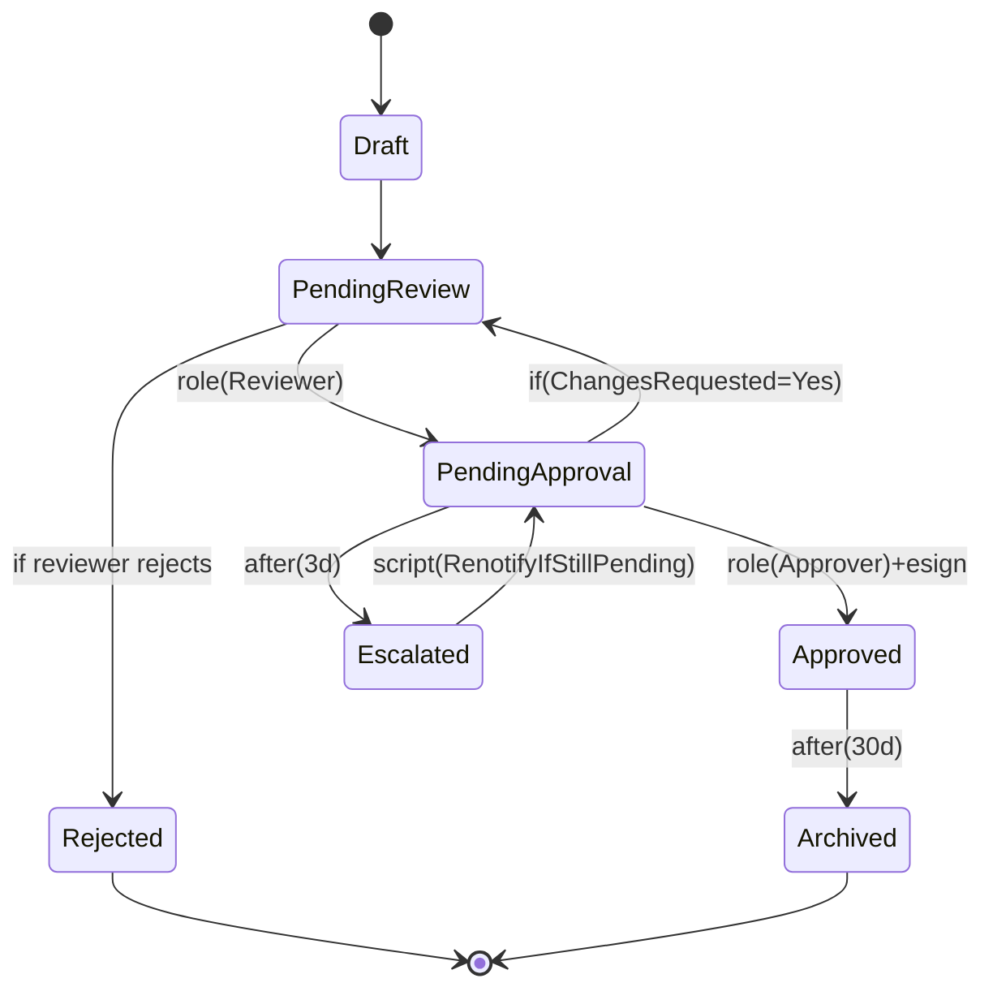
```mermaid
stateDiagram-v2
    [*] --> Draft
    Draft --> PendingReview
    PendingReview --> PendingApproval : role(Reviewer)
    PendingReview --> Rejected : if reviewer rejects
    PendingApproval --> Approved : role(Approver)+esign
    PendingApproval --> PendingReview : if(ChangesRequested=Yes)
    PendingApproval --> Escalated : after(3d)
    Escalated --> PendingApproval : script(RenotifyIfStillPending)
    Approved --> Archived : after(30d)
    Rejected --> [*]
    Archived --> [*]
```

7 real states (`Draft`, `PendingReview`, `PendingApproval`, `Escalated`, `Approved`, `Rejected`, `Archived`), 11 edges — 8 correspond to real M-Files transitions, 3 are Mermaid's `[*]` start/end pseudostates, which don't map to transitions at all (see §6.4). The graph is deliberately cyclic: `PendingApproval → Escalated → PendingApproval` is a genuine two-state retry loop, the same shape as the elapsed-time retry cycle pattern documented in §1 — see the note in §6.4 on why this example uses a two-state cycle rather than the single-state self-loop shown in §1.5's illustrative snippet.

### 6.2 Edge-by-edge translation

| Mermaid edge | §3.5 rule applied | Resulting M-Files field values |
|---|---|---|
| `Draft --> PendingReview` (no label) | Manual transition | `TriggerMode = 0`. No `TriggerCriteria`. No restricted Permissions entry — open to anyone with edit rights on a `Draft`-state object. |
| `PendingReview --> PendingApproval : role(Reviewer)` | Restricted-permission (human) transition | `TriggerMode = 0` (still human-initiated — a role restriction doesn't make it automatic). Permissions tab restricted to the `Reviewer` group (direct group selection, §2.3 method 1). No Electronic Signature. |
| `PendingReview --> Rejected : if reviewer rejects` | **Does not match any §3.5 rule.** Prose, not the `if(Property=Value)` grammar. | Import produces a **skeleton transition only**: `TriggerMode = 0` (the unlabeled/no-match default), no `TriggerCriteria`, no Permissions restriction. The intended semantic — some kind of rejection gate — is silently dropped. See §6.4 for the side-by-side against what a correctly-labeled version would have produced. |
| `PendingApproval --> Approved : role(Approver)+esign` | Restricted-permission transition + Electronic Signature | `TriggerMode = 0`. Permissions restricted to `Approver`. Electronic Signature **required = true** (§2.1) — signature-meaning configuration itself isn't expressible in this label; a translator would need a sensible default or a follow-up prompt. |
| `PendingApproval --> PendingReview : if(ChangesRequested=Yes)` | Criteria-based automatic | `TriggerMode = 4`. `TriggerCriteria` = the opaque, engine-exported search-condition representation equivalent to (not literally the text) `ChangesRequested = Yes` (§1.1 — criteria is never a plain string). `TriggerInDays` left at its non-gating default. |
| `PendingApproval --> Escalated : after(3d)` | Time-based automatic | `TriggerMode = 4`. No `TriggerCriteria` (unconditional once the delay elapses). `TriggerInDays = 3`. |
| `Escalated --> PendingApproval : script(RenotifyIfStillPending)` | VBScript-gated | `TriggerMode = 5`. `TriggerAllowedByVBScript` populated — body in Appendix B below. `TriggerCriteria` not applicable (the script, not a search condition, decides). `TriggerInDays`: **open question, not asserted** — see §6.4. |
| `Approved --> Archived : after(30d)` | Time-based automatic | `TriggerMode = 4`. No `TriggerCriteria`. `TriggerInDays = 30`. |

`[*] --> Draft`, `Rejected --> [*]`, and `Archived --> [*]` are intentionally left out of this table — they aren't transitions at all; see §6.4.

### 6.3 Resulting M-Files structure

As if this were the actual output of an import tool, written to M-Files Admin:

**States (7):**

| State | Initial? | Terminal (no outgoing transitions)? |
|---|---|---|
| `Draft` | Yes (the `[*] --> Draft` start pseudo-edge sets the workflow's Initial state) | No |
| `PendingReview` | No | No |
| `PendingApproval` | No | No |
| `Escalated` | No | No |
| `Approved` | No | No |
| `Rejected` | No | Yes (`Rejected --> [*]`) |
| `Archived` | No | Yes (`Archived --> [*]`) |

**Transitions (8):**

| From → To | TriggerMode | TriggerInDays | TriggerCriteria | VBScript | Permissions | E-Signature |
|---|---|---|---|---|---|---|
| `Draft` → `PendingReview` | 0 | — | — | — | none | No |
| `PendingReview` → `PendingApproval` | 0 | — | — | — | `Reviewer` | No |
| `PendingReview` → `Rejected` | 0 *(skeleton — see §6.4)* | — | — | — | none *(skeleton — see §6.4)* | No |
| `PendingApproval` → `Approved` | 0 | — | — | — | `Approver` | **Yes** |
| `PendingApproval` → `PendingReview` | 4 | default | `ChangesRequested = Yes` (opaque) | — | none | No |
| `PendingApproval` → `Escalated` | 4 | 3 | — | — | none | No |
| `Escalated` → `PendingApproval` | 5 | *unresolved* | — | `RenotifyIfStillPending` | none | No |
| `Approved` → `Archived` | 4 | 30 | — | — | none | No |

### 6.4 Where this is lossless vs. where it required a judgment call

**Lossless (unambiguous under the §3.5 convention):** all 5 correctly-labeled edges — the plain manual edge, both `role(...)` edges (including the `+esign` compound form), the `if(Property=Value)` criteria edge, and both `after(Nd)` time-based edges — translate to a fully-specified M-Files transition with no missing information and no judgment call. This is the convention working as designed.

**Required a judgment call or produced only a skeleton — three real gaps, surfaced by actually building the example rather than asserting the convention works:**

1. **The freeform edge (`if reviewer rejects`) is genuinely ambiguous, not just "unparsed."** A strict importer correctly refuses to guess and produces the bare skeleton shown in §6.2/§6.3. But the *right* fix isn't obvious even to a human reading the prose — it could mean either of two different real M-Files shapes, and picking wrong changes the workflow's actual behavior:
   - If a reviewer clicks a button to reject: `PendingReview --> Rejected : role(Reviewer)` → `TriggerMode = 0`, Permissions restricted to `Reviewer`.
   - If rejection is a property a script or the reviewer's form sets, and the engine should pick it up automatically: `PendingReview --> Rejected : if(Rejected=Yes)` → `TriggerMode = 4`, real `TriggerCriteria`.

   These produce **different `TriggerMode` values and different tab configurations** — not a cosmetic difference. This is the concrete version of §3.5's abstract claim that freeform Mermaid "can only produce a structural skeleton" — here it's a specific pair of plausible-but-different real configurations the convention correctly declines to choose between.

2. **The `[*]` start/end pseudostates aren't transitions, and the convention (§3.5) never says so explicitly.** `[*] --> Draft` sets a *state property* (which state is Initial), not a transition. `Rejected --> [*]` and `Archived --> [*]` are a **translator convention this document is adopting here**, not an M-Files field: "no outgoing transitions" is how a terminal state is represented natively (§3, "End event" row), so an importer must special-case any edge touching `[*]` rather than trying to build a transition object for it. This gap wasn't visible when §3.5 was written in the abstract — it only showed up once a diagram with real start/end markers was actually built.

3. **Two field values in the retry cycle are left honestly unresolved, not guessed:**
   - **`TriggerInDays` on the `script(...)` edge.** §1.2's one confirmed non-default `TriggerInDays` value (a real, deliberate delay) was observed on a `TriggerMode: 4` (criteria) edge. Whether `TriggerInDays` governs re-evaluation frequency the *same* way for a `TriggerMode: 5` (VBScript-gated) edge — i.e., whether it needs to be set low to make the engine re-check the script often, or whether mode-5 edges are re-evaluated on some other cadence entirely — is not established by this project's confirmed findings or by the vendor documentation reviewed for §2. Rather than assert a plausible-looking number, this table leaves it marked unresolved. A real implementation would need to test this specifically before shipping it.
   - **Self-loop vs. two-state cycle, as the correct diagram shape for a retry.** §1.5's illustrative snippet used a single-state self-loop (`Pending --> Pending : script(...)`) for brevity. This worked example instead uses a genuine two-state cycle (`PendingApproval → Escalated → PendingApproval`), which is the shape actually seen in this project's own confirmed retry-loop findings. Neither this document's confirmed findings (§1) nor its vendor-documentation review (§2) establishes whether M-Files' object model even *supports* a transition whose From-state and To-state are the same state (a literal self-transition) — it may be a real, valid construct, or it may be structurally disallowed by the workflow designer. Until that's checked directly against a real vault, **treat the self-loop form as a diagramming convenience for "this state waits on itself," not a confirmed 1:1 M-Files construct**, and prefer the two-state cycle shape (as used here) when the destination is unambiguous.

4. **Flagged, not silently fixed: this section's own diagram (§6.1) predates §3.5's Decision 5 and does not conform to it.** Decision 5 requires any state with two or more outgoing transitions to be authored as a `<<choice>>` pseudostate. `PendingReview` (two outgoing edges: `role(Reviewer)` and the freeform-skeleton edge discussed in point 1 above) and `PendingApproval` (three outgoing edges: `role(Approver)+esign`, `if(ChangesRequested=Yes)`, `after(3d)`) are both drawn as bare multi-edge fan-out, not diamonds. **This document's own copy of the diagram (§6.1) is deliberately left as-is, not retroactively redrawn — intentionally, as a "before" reference, not an oversight:** §6.1-§6.4 exist to demonstrate the label-grammar table and Decision 2's skeleton case, and redrawing it here risks disturbing that already-validated content for a rule that postdates it. §6.10 is this document's own worked example of a correctly-authored diamond — a different, smaller, purpose-built diagram, not a redraw of this one.

   **A redrawn, diamond-authored version of *this exact diagram* does now exist, just not in this document.** `TranslationPlanRenderer.html`'s `section-6-2` sample tab embeds `review_decision` at `PendingReview` and `approval_decision` at `PendingApproval` — both single-inbound, both collapsing per Decision 3 exactly as predicted. **Confirmed via the real Translator/Validator, not asserted:** run through the pipeline and compared field-by-field against this section's own bare-fan-out source, the two produce an **identical** resolved plan — same 7 states, same 8 transitions, every field equal, only the input authoring differs. If a live-rendered, correctly-authored version of *this* diagram specifically is what's needed (as opposed to §6.10's separate example), that renderer tab is it — this section's own Mermaid block stays bare fan-out by design, per the reasoning above.

**A different outcome from all four items above, and deliberately kept visually distinct from them: a diagram that requires true AND-join synchronization is not a skeleton case — it is a blocking error, not a degraded-but-usable plan.** Items 1–3 above all describe an unambiguous *plan* the translator still produces — degraded, flagged, or partially unresolved, but something a human can review and act on. This case is different in kind: there is no M-Files shape to produce at all, correct or degraded, because M-Files has no construct for "wait for more than one specific inbound path to complete before this state becomes reachable." An M-Files object occupies exactly one state at a time, and a state becomes current the instant any single inbound transition fires — that is a platform constraint, not a gap in this convention's grammar that a future revision could close.

This is a genuinely different case from §3.5 Decision 3's promote rule (§6.8): several independent predecessors that can *each separately* trigger arrival at a merge state are fine and native — any one of them reaching it is sufficient, which is exactly how M-Files states already work. The unsupported case is synchronization: arrival requires *all* of several specific predecessors to have completed first, not just one.

The Mermaid grammar this project's convention actually uses (`stateDiagram-v2` state/edge/`<<choice>>` only, per `MermaidParser.cs`) has no syntax of its own for expressing AND-join, and by construction an ordinary diagram authored under §3.5's own convention cannot accidentally imply it — multiple edges converging on one state is always read as the native OR-join case above, correctly. The real risk is an author reaching for genuine Mermaid syntax this convention doesn't otherwise use: `stateDiagram-v2` itself natively supports `<<fork>>` and `<<join>>` pseudostates, and since this project's own convention already asks authors to write `state X <<choice>>`, reaching for `state X <<join>>` next — believing, reasonably but wrongly, that it would behave the same way — is a foreseeable mistake, not a hypothetical one worth dismissing.

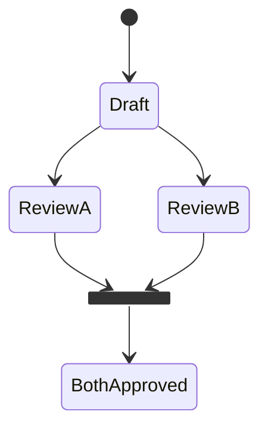
```mermaid
stateDiagram-v2
    [*] --> Draft
    state sync_gate <<join>>
    Draft --> ReviewA
    Draft --> ReviewB
    ReviewA --> sync_gate
    ReviewB --> sync_gate
    sync_gate --> BothApproved
```

**This is rejected outright, not degraded to a skeleton.** The translator recognizes `<<join>>` (and `<<fork>>`, the symmetric AND-split case — an object cannot occupy two states at once either) explicitly, rather than letting it fall through to the generic unrecognized-line warning every other unsupported syntax gets, and reports a blocking `SYNCHRONIZATION_UNSUPPORTED` error:

> M-Files has no synchronized-join construct — an object occupies exactly one state at a time, and a state becomes current the moment any single inbound transition fires, so there is no way to require multiple paths to complete before a state is reached. This diagram cannot be automatically translated. Redesign the workflow to avoid requiring multiple paths to complete before a state is reached.

`sync_gate`, and every edge touching it (`ReviewA --> sync_gate`, `ReviewB --> sync_gate`, `sync_gate --> BothApproved`), is dropped from the plan entirely rather than silently auto-discovered as an ordinary state — the alternative (letting `sync_gate` fall through as an untagged real state with two inbound edges) would have produced a plan that *looks* exactly like §6.8's valid promote case, quietly substituting OR-join semantics for the AND-join the diagram's author actually intended, with no error at all. That silent substitution — not the rejection — is the actual failure mode this case exists to prevent. `Draft --> ReviewA` and `Draft --> ReviewB` are unaffected and still resolve normally, since neither edge touches the rejected node; only the synchronization point and its immediate edges are blocked, not the whole diagram.

**Confirmed live against the actual Translator/Validator, not asserted:** `IsValid` is `false`, `ValidationIssues` contains exactly one `SYNCHRONIZATION_UNSUPPORTED` error naming `sync_gate` and its declared type, `States` contains no `sync_gate` entry, and `Transitions` contains no entry referencing it in either direction — matching the description above exactly. A parallel `<<fork>>` case (one predecessor branching into two states that would need to be simultaneously current) was verified the same way, with the same outcome. A regression check confirmed the ordinary multi-inbound `<<choice>>` promote case (no fork/join marker — the §6.8 shape) is completely unaffected by this change and still produces a valid plan.

### Appendix B — script reference for this example

```vbscript
### script(RenotifyIfStillPending)
Dim daysSinceEscalated
daysSinceEscalated = DateDiff("d", CDate(<escalation timestamp property value>), Now())

If daysSinceEscalated >= 1 Then
    AllowStateTransition = True
End If
```

Same generalized pattern as §1.5's Appendix A, applied to this example's specific edge — re-notify (and allow the transition back to `PendingApproval` for another approval attempt) once at least one day has passed since the object entered `Escalated`.

### 6.5 Future Option: Direct Construction from the Table

**Status: forward-looking note. Nothing in this section has been executed — no vault access, no writes, no construction of any kind has happened as part of adding this note.**

- The §6.2 table is close to an executable build spec, not just a description: each row already states the exact `TriggerMode` / `TriggerCriteria` / `TriggerInDays` / Permissions / VBScript-reference values a real transition would need, in the same shape those fields actually take on a live M-Files transition object. In principle, each row could be walked in order and turned into one real state or transition, using the COM-based write path and the NVS `SetNamedValues` mechanism for VBScript-backed script content — a mechanism this project has already exercised live against a real vault elsewhere in its own work (see this project's own progress/skills logs for that evidence; it isn't repeated here since it's project-specific and this document deliberately isn't). The point being made here is narrow: the write mechanism itself is not hypothetical. Whether *this specific table* builds cleanly from it is untested — see the next point.
- **This has not been attempted.** No vault — test, disposable, or otherwise — has been built from this table. Nothing beyond the diagram, the table, and the structure description already in §6.1–§6.4 has been produced. This section documents an option that exists, not a result that was produced.
- **If/when this is pursued, two constraints apply, stated now so they don't get skipped later under time pressure:**
  1. **Run only against a genuinely disposable test vault — never a vault holding real data.** Everything confirmed elsewhere in this document (§1) is read-only observation; an actual build from this table would be a write, and this project's own standing plan/apply discipline for any real write — recorded elsewhere in this project, not repeated here — applies in full.
  2. **Row 3 (`PendingReview → Rejected : if reviewer rejects`) must be built exactly as documented — a bare skeleton (`TriggerMode = 0`, no `TriggerCriteria`, no Permissions restriction) — not "improved" or disambiguated during construction.** That row's entire purpose in §6 is demonstrating the freeform-input degradation case discussed in §3.5 and §6.4. Quietly picking one of the two plausible fixes from §6.4 while building it would destroy the one thing this example is supposed to prove: that unparseable prose input degrades to a skeleton (Decision 2 case (b)), not that a human can always patch it up by inspection during the build.
- **Two rows stay open and must not be silently resolved during any future construction attempt:** `Escalated → PendingApproval`'s `TriggerInDays` value (§6.2/§6.4 — left unresolved because this project never confirmed whether `TriggerInDays` governs re-evaluation cadence the same way for VBScript-gated transitions as it does for the one confirmed criteria-based case), and the Electronic Signature default signature-meaning text on `PendingApproval → Approved` (§2.1 documents that the *feature* exists, not what a sensible default reason/meaning string should be). A real construction attempt needs an explicit, recorded choice for both — not a plausible-looking silent default.
- **This is the natural next validation step for the whole document.** Actually building one vault from the table is what would convert "the table looks like a build spec" into "the table is confirmed to be one" — the same read-to-write gap this document has flagged in every other section that touches it. It is **explicitly deferred here, not scheduled**: this note assigns no timeline, no owner, and no vault to the idea. It exists so the option isn't lost, not so it gets picked up by default.

### 6.6 Worked Example: Manual vs. Automatic Line Style

Illustrates §3.5's Decision 1. A tiny three-state diagram: one manual edge, one time-based automatic edge.

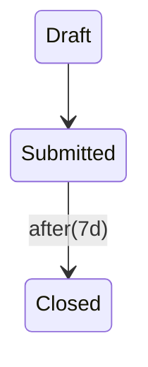
```mermaid
stateDiagram-v2
    Draft --> Submitted
    Submitted --> Closed : after(7d)
```

**M-Files state/transition description:**

| Edge | §3.5 label | `TriggerMode` | M-Files Admin line style (§1.1) |
|---|---|---|---|
| `Draft --> Submitted` | none (unlabeled) | `0` — manual `// TriggerMode = 0` | Solid |
| `Submitted --> Closed : after(7d)` | `after(7d)` — time-based automatic | `4` or `5` `// TriggerMode = 4/5` | Dashed |

**The rendered Mermaid diagram above shows both edges as identical solid lines — this is not an error, it is the confirmed constraint from §3.5's Decision 1.** Mermaid `stateDiagram-v2` has no dashed-line rendering for transitions at all, so the manual/automatic distinction is carried entirely by the `after(7d)` label, never by line style, on the Mermaid side. The solid-vs-dashed distinction only exists once this diagram is imported and viewed as a real workflow in M-Files Admin — where `Draft → Submitted` renders solid (`TriggerMode 0`) and `Submitted → Closed` renders dashed (`TriggerMode 4`/`5`), exactly matching the table above and the direct (non-inverted) mapping the decision establishes.

### 6.7 Worked Example: Collapsing Diamond (Single Inbound)

Illustrates §3.5's Decision 3, single-inbound case. One real state flows into a `<<choice>>` pseudostate, which branches to two outcomes.

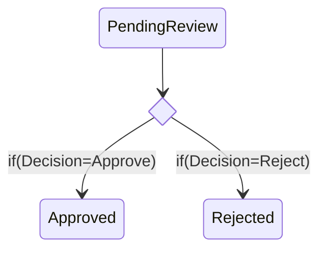
```mermaid
stateDiagram-v2
    state review_outcome <<choice>>
    PendingReview --> review_outcome
    review_outcome --> Approved : if(Decision=Approve)
    review_outcome --> Rejected : if(Decision=Reject)
```

`review_outcome` has exactly one inbound edge (from `PendingReview`) and no other state points into it.

**M-Files equivalent:** 3 real states (`PendingReview`, `Approved`, `Rejected`) and 2 transitions — no state is created for the diamond.

| From → To | `TriggerMode` | `TriggerCriteria` |
|---|---|---|
| `PendingReview` → `Approved` | 4 | `Decision = Approve` (opaque, §1.1) |
| `PendingReview` → `Rejected` | 4 | `Decision = Reject` (opaque, §1.1) |

**The diamond has vanished — no `review_outcome` state exists in the M-Files result.** Per §3.5's Decision 3, a `<<choice>>` pseudostate with exactly one inbound edge collapses entirely on import: its two outgoing branches become direct outgoing transitions of `PendingReview`, the one real state that fed it. No new state is created because none is needed — `PendingReview` already has two real, addressable outgoing transitions once the diamond is removed, the same shape as any other state with multiple conditional outgoing edges (§3's "Exclusive / parallel gateway" row).

### 6.8 Worked Example: Non-Collapsing Diamond (Multiple Inbound)

Illustrates §3.5's Decision 3, multiple-inbound case — otherwise identical to §6.7's diamond, changed only by adding a second predecessor state.

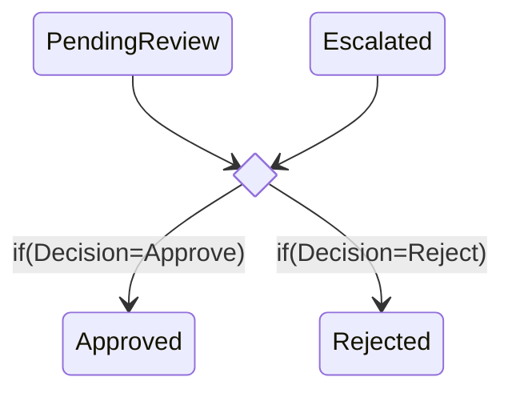
```mermaid
stateDiagram-v2
    state review_outcome <<choice>>
    PendingReview --> review_outcome
    Escalated --> review_outcome
    review_outcome --> Approved : if(Decision=Approve)
    review_outcome --> Rejected : if(Decision=Reject)
```

`review_outcome` now has **two** inbound edges — from `PendingReview` and from `Escalated` — a genuine merge-then-split point.

**M-Files equivalent:** 5 real states (`PendingReview`, `Escalated`, `ReviewOutcome` — new, the diamond promoted to a real state — `Approved`, `Rejected`) and 4 transitions.

| From → To | `TriggerMode` | `TriggerCriteria` |
|---|---|---|
| `PendingReview` → `ReviewOutcome` | 0 *(§3.5 default — genuinely no label, not a skeleton; see Decision 2 case (a))* | — |
| `Escalated` → `ReviewOutcome` | 0 *(§3.5 default — genuinely no label, not a skeleton; see Decision 2 case (a))* | — |
| `ReviewOutcome` → `Approved` | 4 | `Decision = Approve` (opaque, §1.1) |
| `ReviewOutcome` → `Rejected` | 4 | `Decision = Reject` (opaque, §1.1) |

**The diamond became a real, named state (`ReviewOutcome`) — structurally different from §6.7, and it could not have collapsed.** With two real predecessors (`PendingReview` and `Escalated`) both feeding the same diamond, there is no single state to attach `review_outcome`'s outgoing branches to — collapsing it into `PendingReview` alone would silently drop `Escalated`'s path into the same outcomes, and collapsing it into `Escalated` alone would do the reverse. Per §3.5's Decision 3, this is a hard platform constraint, not a judgment call: M-Files transitions are strictly state-to-state, so a node reached from more than one real state must itself be an addressable state. Note also that the two new inbound edges (`PendingReview --> review_outcome`, `Escalated --> review_outcome`) carry no §3.5 label in the source diagram — per Decision 2 case (a), a genuinely bare edge is the labeling convention's own deliberate, lossless manual-transition encoding, **not** a skeleton fallback; nothing was lost by leaving them unlabeled here.

### 6.9 Scoped But Deferred: What Decision 4 Still Leaves Open

**Status: scoping note, not a build.** Neither item below blocks the current Translator/Validator, which only ever produces a plan for a human to review — it never writes to a vault (§1A). Both are recorded here so they aren't lost or re-litigated later, and so neither gets pulled into the current build's scope by accident.

**De-duplication / delta-apply on forced overwrite — downstream of Decision 4, scoped as V1.5.** Decision 4 (§3.5) makes the emitter refuse to touch an existing workflow unless a human passes an explicit override. That override still leaves open *how* an overwrite should actually behave once permitted — the safest real answer is almost certainly not "delete and recreate the whole workflow," but a **diff-and-delta-apply**: compare the existing live workflow against the new plan, and change only what actually differs (states/transitions added, removed, or altered), leaving everything else — and anything M-Files itself owns that the diagram doesn't represent — untouched. Building this well requires the reverse-direction read capability below (to know what the existing workflow actually looks like before diffing against it), so it is sequenced after that, not before. Not designed here; not part of the current translator/validator's scope; flagged as the next real question once Decision 4's override path is actually exercised.

**Reverse direction (M-Files → Mermaid export) — the logical next build after the forward translator/validator is working and tested.** Reading an existing, already-valid vault workflow and emitting Mermaid + a sidecar file is very likely **simpler** than the forward direction this document specifies: there is no freeform/unparseable input to degrade gracefully (Decision 2 case (b) has nothing to do — every field read from a real transition is, by construction, a real value, not an ambiguous guess), no dangling-reference risk (a live workflow's states and transitions are already internally consistent), and no choice-pseudostate collapse decision to make (that's a Mermaid-side authoring convenience with no M-Files-side equivalent to reconstruct — reverse export would simply emit real states as real states, never synthesizing a diamond). Much of §1's confirmed field-mapping logic (`TriggerMode` → line-style/label, `TriggerInDays`, `TriggerCriteria` → `if(...)`, `TriggerAllowedByVBScript` → `script(Name)` + sidecar body, Permissions → `role(...)`, Electronic Signature → `+esign`, and now `EvaluationPriority` → `+priority(N)`) is directly reusable in the reverse direction — it's the same mapping, read the other way. **Scoped as the logical next build after the forward Translator/Validator is working and tested — not started, not designed in detail here, and explicitly not to be folded into the current build's scope.**

**A specific reverse-export gap this pass surfaced, logged here rather than solved:** the forward direction (this document's actual current scope) has no problem emitting `after(365d)` for a real, confirmed `TriggerInDays: 365` value — it's technically accurate (§6.13 uses exactly this real value). But §1.2 already establishes 365 is this platform's own inert UI default, not evidence of an intentional delay, in the overwhelming majority of real transitions — only one non-default value has ever been confirmed anywhere in this project. A reverse exporter reading a live vault faces the opposite version of this problem: it would need to decide whether to *literally* re-emit `after(365d)` on every untouched-default transition — technically correct, but visual clutter for a value nobody actually chose — or to treat a confirmed-365 the same way `EvaluationPriority`'s own default (100) is already treated elsewhere in this convention (§3.5's table: omitted from the label when it matches the platform default, shown only when it genuinely deviates). Lower priority than Decision 6's gap — the forward translation isn't wrong here, only potentially misleading to a human reader — and it's a design question for the not-yet-built reverse direction specifically, not for the forward Translator/Validator this document currently specifies. Noted here so it isn't lost before that work starts.

### 6.10 Worked Example: Diamond Required — Independent, Priority-Raced Branches (§3.5 Decision 5)

**Status: canonical illustration for Decision 5's second branch shape.** This is the corrected replacement for an earlier, incorrectly-authored version of this same example that drew `IncomingInvoice`'s two outgoing edges as bare fan-out — a real authoring mistake caught by Decision 5 being formalized, not a hypothetical one. The plan this diagram resolves to is **functionally identical** to the incorrect version's plan (confirmed by running both through the actual Translator/Validator and comparing every resolved field — see below); only the Mermaid authoring changed.

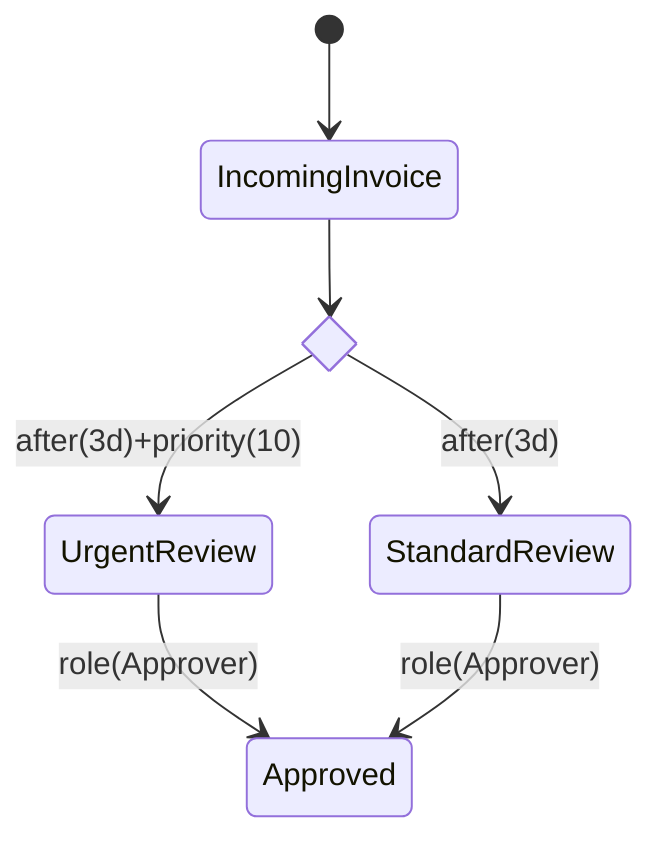
```mermaid
stateDiagram-v2
    [*] --> IncomingInvoice
    state priority_check <<choice>>
    IncomingInvoice --> priority_check
    priority_check --> UrgentReview : after(3d)+priority(10)
    priority_check --> StandardReview : after(3d)
    UrgentReview --> Approved : role(Approver)
    StandardReview --> Approved : role(Approver)
```

**A second real bug surfaced while building this exact example, caught by actually rendering it rather than trusting that syntactically-valid Mermaid renders as intended: `state X <<choice>>` must be declared *before* any edge references `X`, or Mermaid.js silently renders it as a plain state box instead of a diamond.** The diagram above declares `state priority_check <<choice>>` immediately after `[*] --> IncomingInvoice` and before `IncomingInvoice --> priority_check` — deliberately, not incidentally. An earlier draft of this exact example (matching a plausible, syntactically-identical ordering — edge first, declaration second) parsed without error and produced a correct resolved plan when run through the Translator/Validator, but rendered as a labeled rectangle, not a diamond, in Mermaid.js — confirmed directly against a real renderer (`mermaid-cli`), not assumed. This is a **Mermaid.js rendering-order constraint, not a translator or §3.5-convention issue**: the Translator/Validator's own parser collects all `state X <<choice>>` declarations and all edges in two independent passes regardless of line order, so both orderings resolve to an *identical* plan (confirmed — see below) — only the human-facing Mermaid rendering differs. §6.7 and §6.8's diagrams already happened to declare their diamonds first and were never affected; this example is the first place in this document the ordering was ever wrong. Author `state X <<choice>>` before any edge that references `X`, always.

`priority_check` has exactly **one** inbound edge (from `IncomingInvoice`) — Decision 3's single-inbound case, so it collapses away entirely on import, exactly as §6.7's diamond does.

**M-Files equivalent:** 4 real states (`IncomingInvoice`, `UrgentReview`, `StandardReview`, `Approved`) and 4 transitions — no state is created for `priority_check`.

| From → To | `TriggerMode` | `TriggerInDays` | `EvaluationPriority` |
|---|---|---|---|
| `IncomingInvoice` → `UrgentReview` | 4 | 3 | **10** |
| `IncomingInvoice` → `StandardReview` | 4 | 3 | 100 (default) |
| `UrgentReview` → `Approved` | 0 | — | 100 (default) |
| `StandardReview` → `Approved` | 0 | — | 100 (default) |

**Why this state needed a diamond at all, when both branches will genuinely fire independently rather than exclusively — citing §1.6 directly:** `IncomingInvoice` has two automatic outgoing edges, both `after(3d)`, both eligible to fire once the delay elapses. Nothing about `EvaluationPriority` makes one branch "correct" and the other "wrong" the way a true exclusive condition would — §1.6's confirmed vendor text is explicit that the field governs **evaluation order among parallel transitions**, not which one is permitted to fire: *"You can define the priority in which parallel transitions are evaluated on the server. The lower the number, the higher the priority."* `UrgentReview` (`priority(10)`) is simply checked first. Per Decision 5, the diamond is drawn anyway, because the diamond is a structural marker for "this state branches," not a semantic claim that the branches are mutually exclusive — and the labels, not the diamond shape, are what tell a reader (or the translator) that these two branches are independently-raced automatic rules rather than one condition with two outcomes.

**Distinct from §6.2's `PendingApproval → PendingReview : if(ChangesRequested=Yes)` shape, and worth being explicit that both are valid diamond uses:** §6.2's routing (see the flag in §6.4) is a genuine single-condition exclusive branch — the property either equals `Yes` or it doesn't, and exactly one real-world outcome follows. This example's routing is two independently-evaluated automatic rules that happen to share a source state and a delay, distinguished only by which one the server checks first. Both shapes produce a state with two-or-more outgoing transitions; both are required by Decision 5 to be drawn as a diamond; neither shape is inferable from the diamond itself — only from actually reading each branch's label, exactly as Decision 5's reasoning states.

**No regression, confirmed by actually running every version through the Translator/Validator, not asserted:** three variants of this diagram — the original incorrectly-authored bare-fan-out version, an edge-first diamond version (syntactically valid, but the rendering bug described above), and this corrected declaration-first diamond version — were all translated and their resolved plans compared field-by-field. Same 4 states, same 4 transitions, identical `TriggerMode`/`TriggerInDays`/`EvaluationPriority`/`PermissionsGroup`/`IsSkeleton` values on every transition, across all three. The only difference anywhere is the order transitions appear in the plan's `Transitions` array — an artifact of how the collapser appends collapse-generated replacement edges after the edges it left untouched, not a semantic difference, and not something `TranslationPlan` documents any ordering guarantee about in the first place. The Mermaid rendering-order bug is real and affects a human looking at the diagram; it has never affected what the Translator/Validator actually resolves.

### 6.13 Worked Example: Automatic, Mechanism Confirmed But Criteria Undecoded (§3.5 Decision 6)

**Status: built from real (redacted) production data, not invented for this example — the first worked example in this document sourced that way.** This is a minimal excerpt of the exact real hub state and branch that surfaced Decision 6's gap: a 10-branch production decision hub, run through the actual Translator/Validator as part of a real-vault verification pass. All real state names, aliases, and identifiers below have been replaced with generic placeholders per this document's standing redaction convention (§6, header) — no project-specific information is reproduced here or was reproduced in the pass that found this gap.

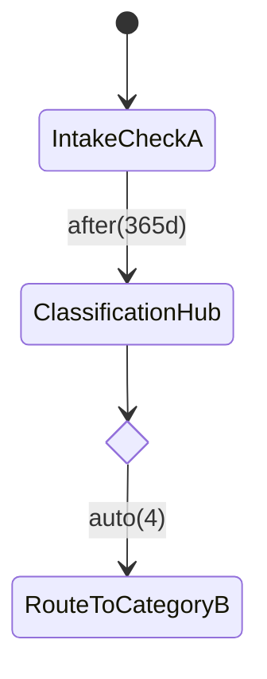
```mermaid
stateDiagram-v2
    [*] --> IntakeCheckA
    state classification_choice <<choice>>
    IntakeCheckA --> ClassificationHub : after(365d)
    ClassificationHub --> classification_choice
    classification_choice --> RouteToCategoryB : auto(4)
```

**What the real data actually established, and what it didn't:** live-queried M-Files transition data confirmed `TriggerMode = 4` (automatic, criteria-based) on the real edge `classification_choice --> RouteToCategoryB` stands in for — a direct, stored field value, not an inference. The specific `TriggerCriteria` condition behind it was never decoded from captured configuration. Before Decision 6 existed, the only honest way to represent "I know this much and no more" was a freeform prose label — which correctly triggers the skeleton fallback (Decision 2), but that fallback's `TriggerMode = 0` (Manual) default is **factually wrong** here, not merely incomplete: the real data already rules out Manual.

**M-Files equivalent:** 3 real states (`IntakeCheckA`, `ClassificationHub`, `RouteToCategoryB`) and 2 real transitions — `classification_choice` collapses away (Decision 3, single inbound from `ClassificationHub`).

| From → To | `TriggerMode` | `TriggerCriteria` | `CriteriaUnconfirmed` | `IsSkeleton` |
|---|---|---|---|---|
| `IntakeCheckA` → `ClassificationHub` | 4 | `null` (§1.2's inert stored default, `after(365d)`) | false | false |
| `ClassificationHub` → `RouteToCategoryB` | **4** | `null` | **true** | **false** |

**Confirmed live against the actual Translator/Validator, not asserted — the specific regression this decision exists to fix:** the same edge, run through the pipeline before and after Decision 6's implementation. Before: `TriggerMode: Manual` (wrong — contradicts the confirmed real value). After: `TriggerMode: AutomaticCriteria` (4), `TriggerCriteria: null`, `CriteriaUnconfirmed: true`, `IsSkeleton: false`. This is a genuine regression check against real captured data, not a new synthetic case built to order — the strongest verification available for a change like this.

**Why `auto(4)` and not a prose phrase:** see Decision 6's reasoning above — the argument is the confirmed `TriggerMode` integer, not a description of what's missing, specifically so an author can't drift off one recognized phrase and silently fall back into the wrong-default skeleton path this decision exists to avoid.
