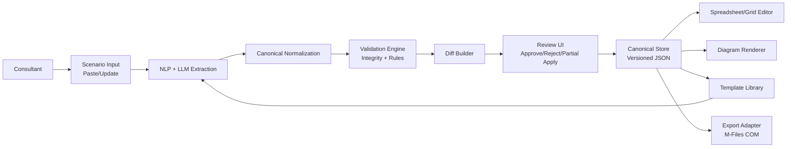
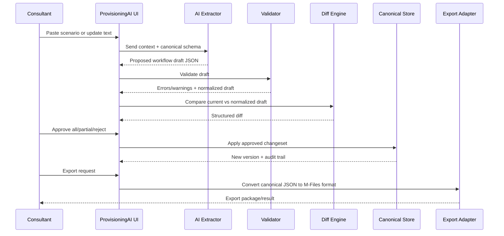

# ProvisioningAI AI Implementation Plan

## 1. Purpose

This document defines a practical technical baseline for implementing ProvisioningAI AI as a knowledge-driven workflow platform.

Core objective:
- Convert consultant intent (plain language scenarios and updates) into validated, editable workflow structures.
- Preserve consultant control with diff review before applying changes.
- Capture reusable implementation knowledge across projects.

## 2. Vision Statement

ProvisioningAI AI transforms implementation expertise into reusable institutional knowledge.

Instead of manually rebuilding each client solution, consultants can:
1. Import or reference existing implementations.
2. Describe target changes in natural language.
3. Review structured diffs proposed by AI.
4. Apply approved changes and export to target platforms (starting with M-Files).

## 3. Product Principles

1. Canonical JSON first.
2. AI proposals, human approval.
3. Deterministic validation gates.
4. Traceable lineage and version history.
5. Export adapters at the edge (one-way final conversion).

## 4. Scope (Initial)

Included in initial implementation:
- Workflow scenario ingestion via paste input.
- AI-assisted extraction of states, transitions, roles, and permissions (where available).
- Structured diff review before apply.
- Live diagram update from approved data.
- Reusable template library (workflow-focused first).

Deferred to later phases:
- Full SQL semantic analysis and auto-remapping.
- Postman/ERP deep automatic reconciliation.
- Multi-platform export beyond M-Files.

## 5. High-Level Architecture



## 6. Canonical Domain Model

### 6.1 Core Entities

- `Workflow`
- `State`
- `Transition`
- `Role`
- `PermissionRule`
- `IntegrationBinding` (OCR/ERP/API)
- `Project`
- `Template`
- `SourceImport`
- `ChangeSet` (diff + approvals)

### 6.2 Canonical Workflow JSON (Draft)

```json
{
  "id": "wf_invoice_approval_v1",
  "name": "Invoice Approval",
  "version": "1.0.0",
  "metadata": {
    "industry": "manufacturing",
    "complexity": "high",
    "tags": ["ap", "approval", "po"]
  },
  "states": [
    { "id": "s_draft", "name": "Draft", "initial": true, "terminal": false },
    { "id": "s_pending", "name": "Pending Approval", "initial": false, "terminal": false },
    { "id": "s_approved", "name": "Approved", "initial": false, "terminal": true }
  ],
  "transitions": [
    {
      "id": "t_submit",
      "from": "s_draft",
      "to": "s_pending",
      "label": "Submit",
      "conditions": [],
      "permissions": ["pr_submitter"]
    },
    {
      "id": "t_approve",
      "from": "s_pending",
      "to": "s_approved",
      "label": "Approve",
      "conditions": ["amount <= 10000"],
      "permissions": ["pr_finance_manager"]
    }
  ],
  "roles": [
    { "id": "r_submitter", "name": "Submitter" },
    { "id": "r_finance_manager", "name": "Finance Manager" }
  ],
  "permissionRules": [
    { "id": "pr_submitter", "type": "transition", "roleId": "r_submitter", "transitionId": "t_submit" },
    { "id": "pr_finance_manager", "type": "transition", "roleId": "r_finance_manager", "transitionId": "t_approve" }
  ],
  "lineage": {
    "sourceTemplateId": "tpl_invoice_ap_v1",
    "sourceImports": ["imp_clientA_vault_2024"]
  }
}
```

## 7. Data Lifecycle



## 8. Validation and Integrity Rules

Mandatory rules (block apply):
1. Exactly one initial state.
2. No duplicate normalized state names.
3. All transition endpoints must reference existing states.
4. No orphan transitions.
5. No invalid permission references.

Warning rules (review needed):
1. Potential semantic duplicates (example: "Approved" vs "Approval Complete").
2. Ambiguous condition extraction.
3. Low-confidence role mapping.
4. Unused roles or unreachable terminal states.

## 9. Diff Model

Supported diff operations:
- `state.add`
- `state.remove`
- `state.rename`
- `state.setInitial`
- `transition.add`
- `transition.remove`
- `transition.update`
- `permission.add`
- `permission.remove`
- `permission.update`

Each diff item should include:
- stable identifier
- before/after payload
- confidence score
- source evidence span (optional but recommended)

## 10. Library and Repository Taxonomy (Detailed)

### 10.1 Complete Folder Structure

```text
provisioningai_master/
│
├── workflows/
│   ├── approbation_v1/
│   │   ├── approbation.json
│   │   ├── bl.json
│   │   ├── maestro.json
│   │   └── metadata.json
│   │
│   ├── contract_lifecycle_v1/
│   │   ├── contract_lifecycle.json
│   │   ├── nda.json
│   │   └── metadata.json
│   │
│   ├── invoice_processing_v1/
│   │   ├── approbation.json
│   │   ├── po_archive.json
│   │   ├── statement.json
│   │   ├── statement_line.json
│   │   └── metadata.json
│   │
│   └── _master/
│       └── (curated best versions of each workflow type)
│
├── ocr/
│   ├── abbyy/
│   │   ├── invoice_mappings.json
│   │   ├── po_mappings.json
│   │   ├── field_config.json
│   │   └── metadata.json
│   │
│   ├── kofax/
│   │   ├── invoice_mappings.json
│   │   ├── field_config.json
│   │   └── metadata.json
│   │
│   └── azure_ocr/
│       ├── field_config.json
│       └── metadata.json
│
├── erp/
│   ├── sap/
│   │   ├── po_queries.sql
│   │   ├── approval_api.json
│   │   ├── postman_collection.json
│   │   └── metadata.json
│   │
│   ├── dynamics365/
│   │   ├── po_queries.sql
│   │   ├── approval_api.json
│   │   ├── postman_collection.json
│   │   └── metadata.json
│   │
│   └── maestro/
│       ├── po_queries.sql
│       ├── postman_collection.json
│       └── metadata.json
│
└── projects/
    ├── clientA_2024/
    │   ├── workflow → ../workflows/approbation_v1
    │   ├── ocr     → ../ocr/abbyy
    │   ├── erp     → ../erp/sap
    │   └── project.json
    │
    └── clientB_2026/
        ├── workflow → ../workflows/approbation_v1
        ├── ocr     → ../ocr/abbyy
        ├── erp     → ../erp/dynamics365
        └── project.json
```

### 10.2 Folder Taxonomy Rationale

- **Patterns are reusable domain knowledge** (workflows/ocr/erp/).
- **Adapters isolate technology/vendor specifics** (sap, dynamics365, abbyy, kofax).
- **Projects link patterns to clients** (projects/).
- **Each asset includes metadata.json** for AI discovery and filtering.
- **Symlinks enable reuse without duplication**.

## 11. Metadata and Discovery Model

### 11.1 Metadata Structure (Example)

```json
{
  "name": "Approbation — Full Maestro",
  "version": "1.0",
  "created": "2024-03-15",
  "client": "Client A",
  "industry": "Manufacturing",
  "workflows": ["Approbation", "BL", "Maestro"],
  "workflow_count": 4,
  "state_count": 34,
  "transition_count": 58,
  "complexity": "high",
  "features": [
    "dual_approval",
    "maestro_integration",
    "pdf_stamping",
    "vendor_notification",
    "po_receipt_matching"
  ],
  "erp": "SAP",
  "ocr": "ABBYY",
  "notes": "Full AP automation with Maestro ERP",
  "reuse_for": [
    "Manufacturing clients",
    "AP invoice processing",
    "Multi-step PO approval"
  ]
}
```

### 11.2 AI Discovery Workflow

When a new client scenario arrives:
1. AI extracts requirements (industry, workflow type, integrations).
2. AI searches all metadata.json files across library.
3. AI ranks templates by feature match, industry match, complexity match.
4. AI presents top 3 recommendations with reasoning.
5. Consultant selects base template.
6. AI adapts template based on new scenario intent.

## 12. Project Configuration and Lineage

### 12.1 Project JSON Structure (Complete Example)

```json
{
  "project_name": "Client B Invoice Processing",
  "client": "Client B Corp",
  "consultant": "Harry Joseph",
  "date_started": "2026-05-11",
  "status": "in_progress",
  "based_on": "clientA_2024",

  "workflow_template": "workflows/approbation_v1",
  "workflow_modifications": [
    "Removed Maestro integration states",
    "Added simplified archive path",
    "Renamed vendor states to match Client B terminology"
  ],

  "ocr_template": "ocr/abbyy",
  "ocr_modifications": [
    "Updated endpoint URL to Client B endpoint"
  ],

  "erp_template": "erp/dynamics365",
  "erp_modifications": [
    "Remapped Vendors table to Suppliers",
    "Updated base URL and credentials"
  ],

  "export_history": [
    {
      "date": "2026-05-11",
      "vault": "{GUID-123}",
      "status": "success",
      "workflows_exported": 3,
      "notes": "Initial export after template adaptation"
    }
  ],

  "ai_conversation": [
    {
      "turn": 1,
      "role": "user",
      "content": "Same as Client A but Dynamics instead of SAP"
    },
    {
      "turn": 2,
      "role": "assistant",
      "content": "Remapped 12 fields from SAP to Dynamics. Removed Maestro integration. Updated ERP queries."
    },
    {
      "turn": 3,
      "role": "user",
      "content": "Simplify the approval path - no dual approval needed"
    }
  ],

  "ready_checklist": [
    { "item": "Workflow exported", "done": true },
    { "item": "ERP endpoint updated", "done": false },
    { "item": "OCR credentials added", "done": false },
    { "item": "Field mappings verified", "done": false }
  ]
}
```

### 12.2 Lineage and Traceability

Every project.json stores:
- Template source reference.
- Modification log per adapter.
- AI conversation history.
- Export audit trail.
- Ready-to-deploy checklist.

This enables:
- Reverting to prior template version.
- Understanding how Client B differs from Client A.
- Replaying the adaptation for future clients.
- Proving compliance and decision records.

## 13. Why JSON Throughout

### 13.1 Four Strategic Reasons

**1. JSON is AI-Native**
- AI reads JSON perfectly.
- AI writes JSON perfectly.
- AI can diff two JSON files.
- AI can merge two JSON files.
- AI can explain what changed between versions.

Contrary:
- M-Files proprietary format: AI cannot read it, modify it, or reason about it.

**2. JSON is Version Controllable**
- Git tracks every change.
- "Who removed the Maestro states?" → git log shows it.
- "When was this transition added?" → git blame shows it.
- "What was the workflow before Client B?" → git show shows it.

Contrary:
- M-Files proprietary format is binary.
- Git cannot diff it meaningfully.

**3. JSON Enables the Template Library**
- New client arrives.
- Consultant opens ProvisioningAI.
- AI reads all JSON templates in library.
- AI recommends: "Use invoice_processing_v1 as base."
- Consultant picks the closest match.
- AI adapts it.

Without JSON library discoverability:
- Templates become dead artifacts.
- Each implementation starts from scratch.
- Knowledge capture fails.

**4. JSON Separates Concerns Cleanly**
- Workflow logic → workflows/
- OCR mappings → ocr/
- ERP connections → erp/
- Project config → projects/

Each concern lives independently and can be updated without touching others.

Example: Client B gets new OCR vendor.
- Only ocr/ folder changes.
- Workflow and ERP untouched.
- Export only regenerates OCR portion.

### 13.2 The Export Boundary

```
ProvisioningAI operates 100% in JSON
  ↓
Human readable
AI readable
Version controllable
Diffable
Portable
Platform agnostic

Only when consultant clicks Export:
  JSON → M-Files proprietary format
  via COM API
  
The conversion is one-way and
happens at the last possible moment
```

## 14. MVP Roadmap

### Phase A - Foundation
- Define canonical schemas.
- Build normalization utilities.
- Build validation engine.

### Phase B - AI Workflow Drafting
- Add AI prompt bar and scenario input panel.
- Add extraction pipeline (NLP + LLM + post-processing).
- Generate draft and render preview.

### Phase C - Safe Apply
- Build diff engine and review UI.
- Add partial apply and rollback points.
- Persist versions and audit metadata.

### Phase D - Template Reuse
- Template catalog and metadata indexing.
- Similar-template recommendation.
- Project bootstrapping from template + prompt intent.

### Phase E - Integration Expansion
- OCR mapping import normalization.
- ERP SQL/API artifact indexing.
- Advanced adaptation recommendations.

### Phase F - Institutionalization (Beta III Complete)
- Template quality metrics and deprecation.
- Searchable implementation history.
- Multi-project analytics and reuse insights.
- Industry-specific template packs.

## 15. Library UI Component

```
┌─────────────────────────────────────────────┐
│ 📚 ProvisioningAI Library                          │
│                                             │
│ WORKFLOWS                                   │
│ ─────────────────────────────────────────  │
│ 📁 approbation_v1    4 workflows  High      │
│ 📁 contract_v1       2 workflows  Medium    │
│ 📁 invoice_v2        3 workflows  High      │
│ 📁 nda_simple        1 workflow   Low       │
│                                             │
│ OCR                                         │
│ ─────────────────────────────────────────  │
│ 📁 abbyy             3 configs             │
│ 📁 kofax             2 configs             │
│ 📁 azure_ocr         1 config              │
│                                             │
│ ERP                                         │
│ ─────────────────────────────────────────  │
│ 📁 sap               4 templates           │
│ 📁 dynamics365       3 templates           │
│ 📁 maestro           2 templates           │
│                                             │
│ PROJECTS                                    │
│ ─────────────────────────────────────────  │
│ 📁 clientA_2024      ✅ Exported           │
│ 📁 clientB_2026      🔨 In progress        │
│ 📁 clientC_2026      📝 Draft              │
└─────────────────────────────────────────────┘
```

Library UI Features:
- Browse templates by category.
- Filter by industry, complexity, features.
- View metadata and reuse recommendations.
- Launch new project from template.
- Search across all templates and projects.

## 16. Non-Functional Requirements

- Reliability: no direct AI write into live state.
- Explainability: show why a state/transition was inferred.
- Performance: draft generation target under 10 seconds for common scenarios.
- Security: data segregation per client/project; no accidental cross-project leakage.
- Auditability: every applied changeset must be attributable.

## 17. Risks and Mitigations

1. AI hallucinated transitions.
Mitigation: strict validation + blocked apply.

2. Overwrite of manual expert edits.
Mitigation: diff-first workflow + selective apply.

3. Template drift and quality decay.
Mitigation: template scoring, curation status, and deprecation metadata.

4. Vendor lock-in assumptions in patterns.
Mitigation: separate domain patterns from technology adapters.

## 18. Definition of Done (MVP)

MVP is complete when all are true:
1. Consultant can paste a scenario and generate a valid draft workflow.
2. System displays structured diff against current workflow.
3. Consultant can approve partial or full changes.
4. Spreadsheet and diagram update from approved canonical state.
5. Project history records the changeset and export metadata.

## 19. Demo Script (Executive-Friendly)

1. Import existing workflow template (example: AP approval).
2. Paste instruction: "No Maestro integration, simplify approval path."
3. Show AI proposal and diff summary.
4. Approve selected changes.
5. Show updated diagram and grid.
6. Export to M-Files.

Expected demo outcome:
- clear time reduction
- clear safety controls
- clear evidence of reusable knowledge

## 20. Immediate Next Actions (Progression to Beta III)

### Sprint 1-2: Foundation
1. Lock canonical workflow JSON schema v0.1.
2. Implement validation engine and contract tests.
3. Define diff payload spec and UI review state machine.
4. Create folder structure and metadata discovery indexer.

### Sprint 3-4: AI Prompt Bar (Most Visible MVP)
1. Add AI prompt bar to the diagram canvas.
2. Wire bar to current workflow JSON as context.
3. Implement extraction pipeline (NLP + LLM + post-processing).
4. Display diff summary before apply.

### Sprint 5-6: Safe Apply
1. Build diff review UI with approve/reject/partial apply.
2. Implement apply pipeline guarded by validation and approval.
3. Persist versions and audit metadata to project.json.
4. Add rollback capability.

### Sprint 7-8: Template Library UI
1. Build Library panel showing workflows, OCR, ERP.
2. Implement template search and filtering.
3. Add "Launch Project from Template" workflow.
4. Index and update metadata.json files.

### Sprint 9-10: Conversation Memory & Project Config
1. Add AI conversation history to project.json.
2. Implement project.json tracking and ready checklist.
3. Add project lineage visualization.
4. Display modification history per adapter.

### Target Outcome
Beta III = Complete institutional knowledge platform:
- Scenario → AI draft → Diff review → Apply → Export.
- Full template reusability across clients.
- Conversation history and project lineage retained.
- Ready for scaling to multiple consultants and clients.
