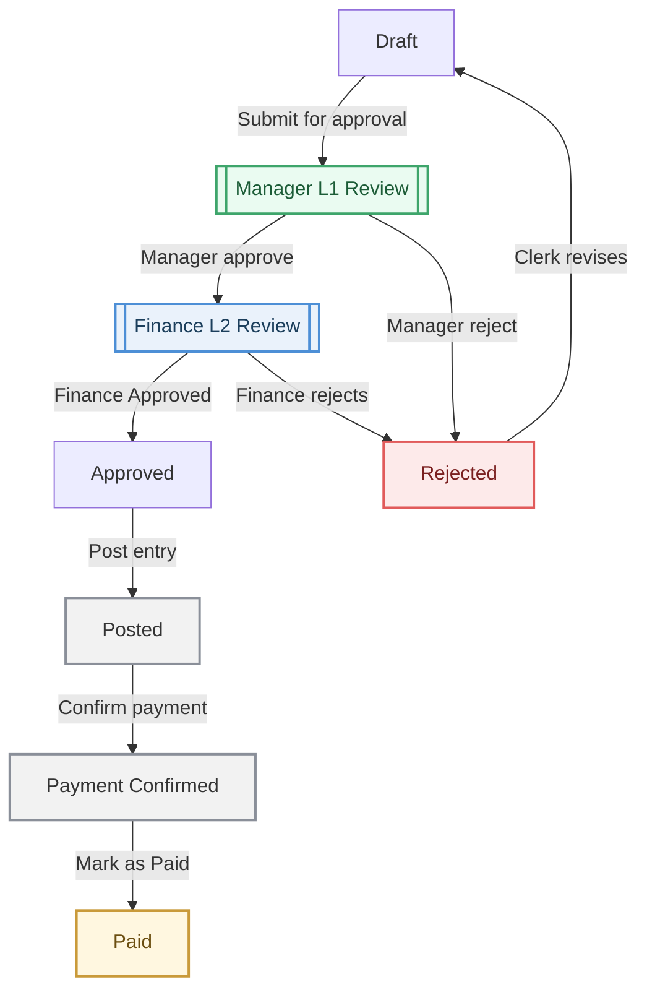

# PRD: Mermaid → M-Files Workflow Designer — Skeleton-Only Translation Model

**Status:** Locked architecture. Supersedes the transition-gateway-marker-as-DOM-injection design from the earlier draft of this PRD (see §11 changelog).

## 1. Overview

A visual designer that lets a non-M-Files-expert draw a workflow once, in plain readable Mermaid, and mechanically derive the **skeleton** of an M-Files workflow from it — the States and Transitions themselves — while leaving all M-Files "life" (permissions, conditions, VBScript, e-signature, notifications) to be configured afterward by a person working directly in M-Files Admin. The tool does not attempt to serialize M-Files configuration into Mermaid text. It draws a map of *what to build and where*, not a spec of *how to configure it*.

A working mockup of this tool ships alongside this PRD as `Mermaid_M-FilesFlow.html`.

## 2. Problem statement

The current process is two separate design passes: a BPMN-compliant diagram in Cacoo, then a second, independent rebuild of the same logic as M-Files States and Transitions in Admin. These two representations drift, and BPMN's full vocabulary (parallel gateways, event gateways, formal merge nodes) doesn't correspond to anything M-Files can actually execute — an M-Files object occupies exactly one state at a time; there is no native parallel-token execution the way a BPMN engine has. Early attempts to solve this by embedding M-Files configuration syntax directly into Mermaid labels (`if(Status=Approved)`, `role(Approver)+esign`) were rejected: M-Files' own properties documentation shows several of those fields (Transition Permissions, Electronic Signature) are not yet vendor-verified, and baking unverified field syntax into a parser defeats the purpose of a confidence-tracked source of truth. More fundamentally, that approach asked Mermaid to carry a payload — permissions, scripts, property definitions — it was never designed to hold.

## 3. The governing architecture: Skeleton vs. Life

| Layer | Lives in | Carries |
|---|---|---|
| **Skeleton** | Mermaid diagram | State names, Transition names, and a boolean flag on states that need branching logic configured |
| **Life** | M-Files Admin, added by a person after the skeleton exists | Actions, Conditions/preconditions, VBScript, permissions, e-signature, notifications, property definitions, trigger criteria |

The Mermaid diagram is a **blueprint**, not a build spec. A translator script reading it performs a **mechanical, zero-interpretation mapping** — it never parses conditional logic out of label text, because no conditional logic is ever written into label text.

## 4. Goals

- A diagram any executive can read with no M-Files or BPMN background.
- A notation reduced to the fewest primitives that still map 1:1 to real M-Files objects — no vocabulary that can't actually be built (see §5, non-goals).
- A translator that requires no string-parsing of business logic — only structural reads (node IDs, shapes, classes, edges).
- An interactive designer (`Mermaid_M-FilesFlow.html`) where a builder can visually assign a state's archetype from a palette, without ever typing raw Mermaid syntax by hand.

## 5. Non-goals

- **No BPMN compliance requirement.** Where BPMN vocabulary doesn't help translation fidelity, it's dropped rather than kept for its own sake.
- **No AND/OR/Event gateways.** M-Files has no native parallel-execution model, so these BPMN gateway types have no faithful M-Files target. They are deliberately excluded from the palette so nothing drawable is undrawable in M-Files — the tool never lets someone design something it can't actually deliver.
- **No merge gateway.** Multiple transitions arriving at one state is natively supported by both Mermaid and M-Files with zero extra notation. Do not add a node for this.
- **No embedded M-Files field syntax in labels or node text** (`if()`, `role()`, `+esign`, etc.). This was tried and explicitly reversed — see §11.
- **Not an export/provisioning tool.** Out of scope for this PRD: actually writing to a live M-Files vault. This tool produces a translation plan (§7) for a human to execute in Admin.

## 6. The 3-primitive model

| # | Primitive | Mermaid syntax | M-Files target | Notes |
|---|---|---|---|---|
| 1 | **State** | `ID[Label]` | An M-Files **State** | Plain rectangle. The visible label is the State's `Name` field, verbatim — no parsing. |
| 2 | **Transition** | `A -->|Label| B` | An M-Files **Transition** | The arrow label is the exact text a user will click on the metadata card — also verbatim, no parsing. |
| 3 | **Gateway flag** | `ID[[Label]]` (double-border / "subroutine" shape) | A to-do flag: *this State needs its Conditions tab / transition trigger configured in Admin* | Purely boolean. Present only on states with 2+ conditional outgoing transitions. Does not encode *what* the condition is. |

Archetype hints (see §7) ride on top of primitive 1 and 3 via Mermaid's native `:::className` mechanism — never inside the label text, and never inside the arrow label.

### 6.1 Why `:::className`, not inline text

An earlier draft proposed `[[Manager L1 Review (Route-checkpoint)]]` — the archetype hint inside the visible label. This was tried and reversed for two reasons:
- **It isn't actually zero-parsing.** A script reading that string still has to split the hint away from the real State name before using either piece — a regex, however small, is still interpretation, which contradicts the core promise of this architecture.
- **It clutters the one thing this whole redesign was for** — a label an executive can read without translation. `Manager L1 Review` reads instantly. `Manager L1 Review (Route-checkpoint)` requires the reader to already know what a route-checkpoint is.

`:::className` fixes both: the script reads the class attribute structurally (no string splitting, ever), and the visible label stays exactly the plain state name.

## 7. Archetype taxonomy (carried via class, not text)

Reused directly from the existing conformity taxonomy (`conformity_workflow.html`) so the same vocabulary spans this tool and the rest of the Conformity project:

| classDef | Color | Archetype meaning | Typical M-Files to-do this implies |
|---|---|---|---|
| `routeCheckpoint` | Green | A state whose job is to route the object onward based on a condition | Configure a property-based or advanced Condition on the outgoing transitions |
| `controlValidation` | Blue | A state that validates something before letting the object proceed | Configure preconditions / postconditions; possibly a VBScript check |
| `automaticAction` | Grey | A state where something happens without a human decision (e.g. an API call, a calculated field) | Configure a State Action (Set properties, Run script, Send notification) |
| `trashReject` | Red | A terminal or near-terminal rejection/failure state | Configure Delete/Mark for archiving actions if applicable, or just the transition back into the live flow |
| *(unclassed)* | Neutral/default | A plain pass-through state with no special M-Files configuration expected | Nothing beyond the State's Name/Description |

This is a **hint for the human**, not an instruction for the script beyond "log a to-do labeled with this archetype." The script never infers *specific* M-Files fields from the archetype — that inference is exactly the kind of interpretation this architecture avoids.

## 8. Icon palette — role and scope

**Critical scope boundary:** the icon palette below is a feature of the **interactive designer's canvas rendering only**. It is never written into the exported `.mmd` source. The portable Mermaid file always stays reduced to the 3 primitives in §6 — plain labels, `[[ ]]` shape, `:::className`. The icon is a cosmetic badge the designer draws on top of the rendered SVG, purely so a human building the diagram has a visual (not just color-coded) cue for each gateway state's archetype, layered on via the same kind of post-render DOM injection used earlier in this project for the transition gateway marker mockups.

| Icon | Name | Best fit |
|---|---|---|
| ◆ / ⬥ | Diamond (classic) | Default. Most BPMN-recognizable, safest for mixed audiences. |
| ⚖ | Scales | Approval-specific workflows (AP, HR sign-off, compliance) |
| ⚡ / ⑂ | Fork | Technical/systems routing, deterministic branches rather than human judgment calls |
| 🔀 | Shuffle | Informal/internal sketches; least formal |
| ✓ / ✗ split | Outcome split | When showing both outcomes explicitly, not just "a decision exists," is worth the extra visual space |

The palette selection is a **designer preference**, not diagram data — picking a different icon changes how the canvas looks to the person building it, never what gets written to the `.mmd` file or read by the translator.

## 9. The Golden Template (locked)

Notice: no `Submit for approval` node. That text lives only on the arrow, because it's a Transition, not a State — collapsing it into its own node would have been exactly the kind of extra vocabulary §5's non-goals rule out.

## 10. Step-by-step: how a translator reads this file

1. **Read every node definition line.** For each, capture: node ID, shape (`[ ]` single vs. `[[ ]]` double), label text, and any `:::className` suffix.
2. **Node with `[ ]` and no class →** emit a plain State with `Name = label`, no to-do.
3. **Node with `[ ]` and a class →** emit a State with `Name = label`; log a to-do tagged with the archetype's typical M-Files area (§7's rightmost column), but do not attempt to fill in specific field values.
4. **Node with `[[ ]]` (regardless of class) →** emit a State with `Name = label`; always log a to-do: *"Configure Conditions tab / transition trigger for this state."* If a class is also present, append the archetype hint to that same to-do line.
5. **Read every edge line** (`A -->|Label| B`). Emit a Transition with `Name = Label`, `From = A`, `To = B`. Nothing else is inferred.
6. **Output** is a two-table plan — States (with to-dos) and Transitions — handed to a person to build in M-Files Admin. No VAF code, no vault API calls, no attempt to set any field beyond Name.

This is intentionally mechanical enough that steps 2–6 could be implemented as a few dozen lines of regex-based parsing with no natural-language interpretation anywhere in the pipeline — which is the whole point.

## 11. Changelog / rejected approaches (kept for institutional memory)

- **Rejected:** Encoding M-Files trigger/condition logic directly in arrow labels (`if(Status=Approved)`, `after(2d)`). Reversed once the skeleton/life boundary was established — that logic belongs in M-Files Admin, not the blueprint.
- **Rejected:** `role(Approver)+esign` inline syntax. Cross-checked against the properties spreadsheet: Transition Permissions and Electronic Signature are both still 🔵/unverified fields, and conflating two different M-Files tabs (Permissions, Electronic Signature) into one regex-matched string worked against, not with, the tab structure it was meant to translate to.
- **Rejected:** Archetype hint inside the visible label text, e.g. `[[Manager L1 Review (Route-checkpoint)]]`. Reversed in favor of `:::className` — see §6.1.
- **Superseded:** The original transition-gateway-marker-as-standalone-DOM-injected-diamond design (previous version of this PRD, §6.3/§8 in that draft). The `[[ ]]` double-border shape is native, valid Mermaid — it needs no post-render script to exist at all. Post-render injection is now used only for the *optional cosmetic icon badge* layered on top of it in the designer canvas (§8), not for the marker itself.

## 12. Open questions

- Should a state with 3+ outgoing transitions from a `[[ ]]` gateway get any visual difference from one with exactly 2, or does the boolean flag stay binary regardless of branch count?
- Should the designer warn (not block) if a user assigns an archetype class to a plain `[ ]` state that has no outgoing transitions at all — likely a modeling mistake, but not necessarily one the tool should refuse?
- Long-term: should the designer's save format (as opposed to the exported `.mmd`) persist anything beyond what's already recoverable from parsing the `.mmd` itself — e.g., is there designer-only state (canvas layout/zoom, chosen icon style) worth keeping separate from the portable diagram?
